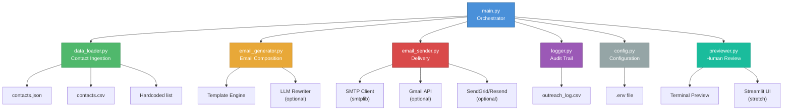
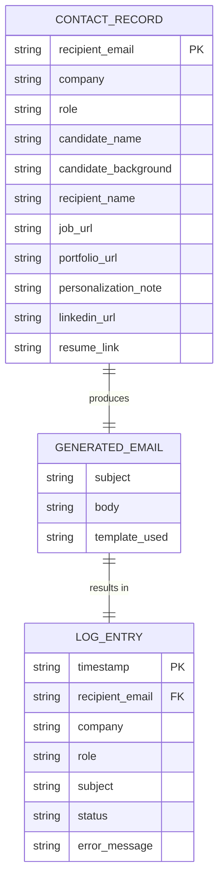
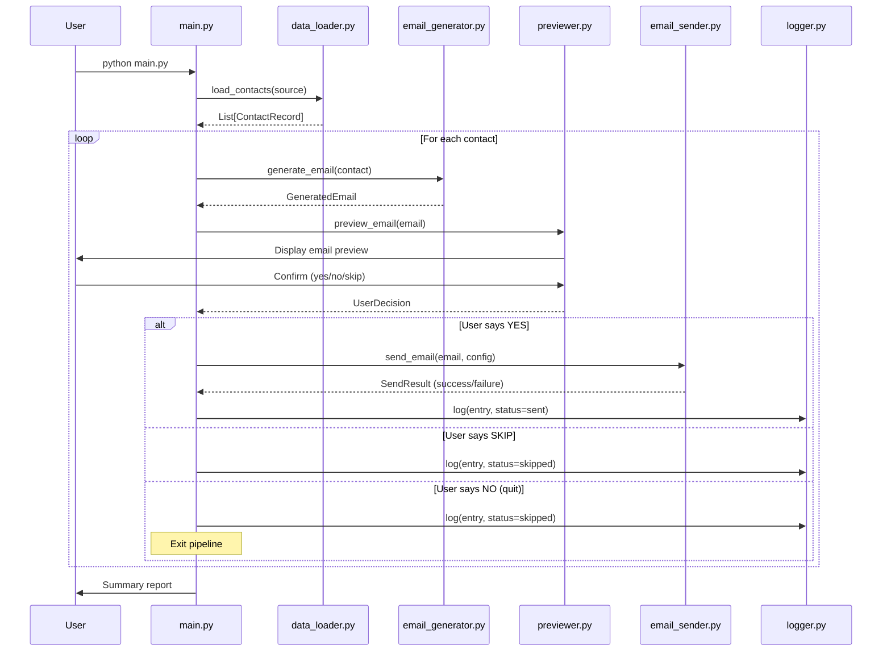
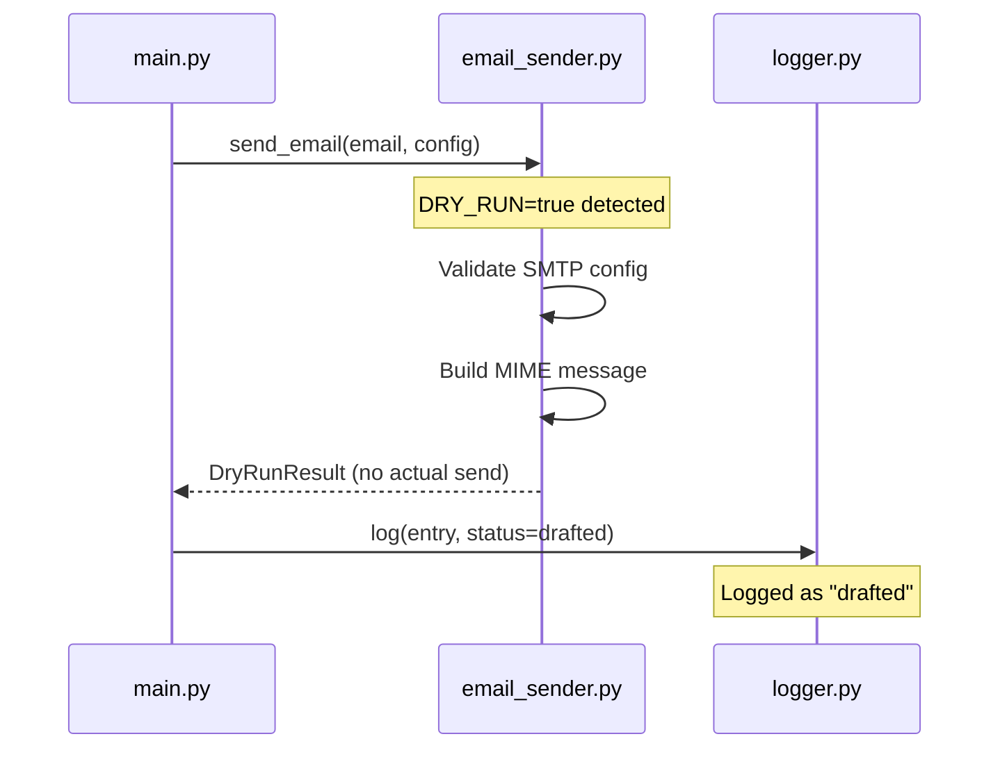
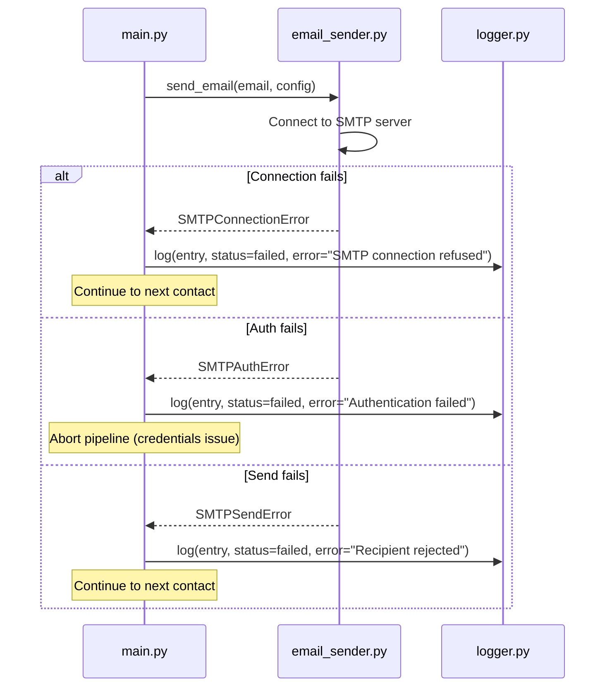
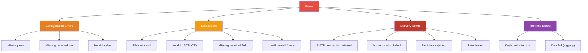
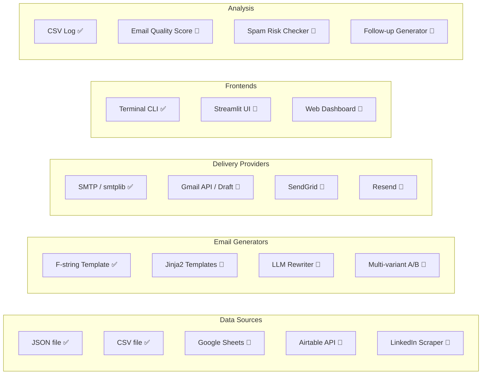
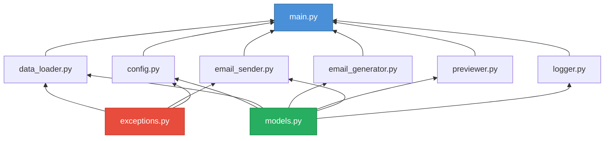
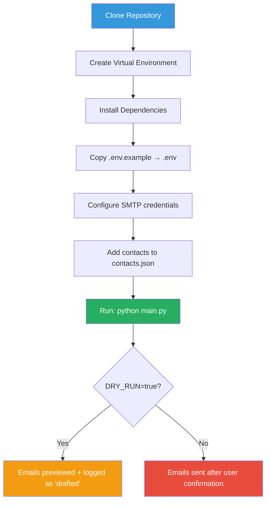

# Architecture Document: The Closer
## Cold Email Writer + Send Bot

> **Version:** 1.0  
> **Date:** 2026-06-01  
> **Derived from:** [ProblemStatement.md](file:///Users/pavan2102/Documents/MacBook-Documents/Projects/Cold%20Email%20Parser/docs/ProblemStatement.md)

---

## Table of Contents

1. [System Overview](#1-system-overview)
2. [Architecture Principles](#2-architecture-principles)
3. [High-Level Architecture](#3-high-level-architecture)
4. [Component Architecture](#4-component-architecture)
5. [Data Models](#5-data-models)
6. [Sequence Diagrams](#6-sequence-diagrams)
7. [Module Specifications](#7-module-specifications)
8. [Configuration Management](#8-configuration-management)
9. [Error Handling Strategy](#9-error-handling-strategy)
10. [Safety & Guardrail Architecture](#10-safety--guardrail-architecture)
11. [Extension Points](#11-extension-points)
12. [Folder Structure](#12-folder-structure)
13. [Dependency Map](#13-dependency-map)
14. [Deployment & Execution](#14-deployment--execution)
15. [Testing Strategy](#15-testing-strategy)

---

## 1. System Overview

**The Closer** is a CLI-based cold email automation agent that helps job seekers generate and send personalized outreach emails. The system follows a **pipeline architecture** with clear separation of concerns: data ingestion → email generation → human review → delivery → logging.

### Key Design Goals

| Goal | Description |
|------|-------------|
| **Simplicity** | Explainable in a live coding session; no unnecessary abstractions |
| **Safety-first** | Dry-run by default; human review required before any send |
| **Modularity** | Each pipeline stage is an independent, testable function |
| **Extensibility** | Easy to swap email providers, add LLM rewriting, or bolt on a UI |
| **Traceability** | Every email attempt is logged with full context |

---

## 2. Architecture Principles

1. **Single Responsibility** — Each module handles exactly one stage of the pipeline.
2. **Fail-safe Defaults** — `DRY_RUN=true` is the default; the system never sends without explicit confirmation.
3. **Dependency Injection** — Email sender, logger, and generator are injected via configuration, not hardcoded.
4. **Stateless Processing** — Each contact is processed independently; no shared mutable state between records.
5. **Configuration over Code** — Secrets, SMTP settings, and runtime behavior are driven by `.env`.

---

## 3. High-Level Architecture

```
┌─────────────────────────────────────────────────────────────────────┐
│                        THE CLOSER — Pipeline                        │
│                                                                     │
│  ┌──────────┐   ┌──────────────┐   ┌─────────┐   ┌──────────────┐ │
│  │  Data     │   │  Email       │   │ Human   │   │  Email       │ │
│  │  Loader   │──▶│  Generator   │──▶│ Review  │──▶│  Sender      │ │
│  │          │   │              │   │         │   │              │ │
│  └──────────┘   └──────────────┘   └─────────┘   └──────────────┘ │
│       │                │                │               │          │
│       │                │                │               │          │
│       ▼                ▼                ▼               ▼          │
│  ┌─────────────────────────────────────────────────────────────┐   │
│  │                     Logger (outreach_log.csv)                │   │
│  └─────────────────────────────────────────────────────────────┘   │
│                                                                     │
│  ┌─────────────────────────────────────────────────────────────┐   │
│  │              Config Manager (.env / env vars)               │   │
│  └─────────────────────────────────────────────────────────────┘   │
└─────────────────────────────────────────────────────────────────────┘
```

### Pipeline Flow

```
Input Data ──▶ Validate ──▶ Generate ──▶ Preview ──▶ Confirm ──▶ Send/Draft ──▶ Log
  (JSON/CSV)    (Schema)    (Template/     (Terminal)   (y/n)     (SMTP/API)   (CSV)
                             LLM)
```

---

## 4. Component Architecture

### 4.1 Component Diagram



### 4.2 Component Responsibilities

| Component | File | Responsibility |
|-----------|------|----------------|
| **Orchestrator** | `main.py` | Drives the pipeline; iterates over contacts, coordinates all stages |
| **Data Loader** | `data_loader.py` | Reads and validates contact records from JSON, CSV, or hardcoded lists |
| **Email Generator** | `email_generator.py` | Produces subject + body using templates or LLM |
| **Previewer** | `previewer.py` | Formats email for terminal display; collects user confirmation |
| **Email Sender** | `email_sender.py` | Sends or drafts emails via SMTP, Gmail API, or third-party service |
| **Logger** | `logger.py` | Appends structured log entries to `outreach_log.csv` |
| **Config Manager** | `config.py` | Loads `.env`, validates required settings, exposes typed config |

---

## 5. Data Models

### 5.1 Contact Record (Input)

```python
from dataclasses import dataclass, field
from typing import Optional

@dataclass
class ContactRecord:
    """Represents a single outreach target."""

    # ── Required fields ──
    recipient_email: str
    company: str
    role: str
    candidate_name: str
    candidate_background: str

    # ── Optional fields ──
    recipient_name: Optional[str] = None
    job_url: Optional[str] = None
    portfolio_url: Optional[str] = None
    personalization_note: Optional[str] = None
    linkedin_url: Optional[str] = None
    resume_link: Optional[str] = None
```

### 5.2 Generated Email (Internal)

```python
@dataclass
class GeneratedEmail:
    """Output of the email generation stage."""

    subject: str
    body: str
    contact: ContactRecord                 # Reference back to input
    template_used: str = "default"         # Which template/model produced this
```

### 5.3 Outreach Log Entry (Output)

```python
from datetime import datetime
from enum import Enum

class OutreachStatus(Enum):
    GENERATED = "generated"
    DRAFTED = "drafted"
    SENT = "sent"
    SKIPPED = "skipped"
    FAILED = "failed"

@dataclass
class LogEntry:
    """Single row in outreach_log.csv."""

    timestamp: str                         # ISO 8601
    recipient_email: str
    company: str
    role: str
    subject: str
    status: OutreachStatus
    error_message: Optional[str] = None
```

### 5.4 Application Config

```python
@dataclass
class AppConfig:
    """Typed representation of .env configuration."""

    smtp_host: str = "smtp.gmail.com"
    smtp_port: int = 587
    smtp_user: str = ""
    smtp_password: str = ""
    sender_name: str = ""
    dry_run: bool = True                   # Safe default
    send_mode: str = "smtp"               # smtp | gmail_api | sendgrid | resend
    llm_enabled: bool = False             # Whether to use LLM for rewriting
    llm_api_key: Optional[str] = None     # Groq API key
    llm_provider: str = "groq"             # LLM provider (groq)
    llm_model: str = "llama-3.3-70b-versatile"  # Groq model name
    log_file: str = "outreach_log.csv"
    input_file: str = "contacts.json"
```

### 5.5 Entity Relationship Diagram



---

## 6. Sequence Diagrams

### 6.1 Main Pipeline — Happy Path



### 6.2 Dry Run Mode



### 6.3 Error Recovery Flow



---

## 7. Module Specifications

### 7.1 `config.py` — Configuration Manager

```python
"""
Responsibilities:
  - Load environment variables from .env file
  - Validate required settings
  - Expose typed AppConfig instance

Public API:
  - load_config() -> AppConfig
"""
```

| Function | Signature | Returns | Description |
|----------|-----------|---------|-------------|
| `load_config` | `(env_path: str = ".env") -> AppConfig` | `AppConfig` | Loads `.env`, validates required fields, returns typed config |

**Validation Rules:**
- If `DRY_RUN=false`, then `SMTP_USER` and `SMTP_PASSWORD` must be set
- `SMTP_PORT` must be a valid integer
- `SEND_MODE` must be one of: `smtp`, `gmail_api`, `sendgrid`, `resend`

---

### 7.2 `data_loader.py` — Contact Ingestion

```python
"""
Responsibilities:
  - Load contacts from JSON, CSV, or hardcoded list
  - Validate required fields on each record
  - Return list of validated ContactRecord objects

Public API:
  - load_contacts(source: str) -> List[ContactRecord]
  - validate_contact(data: dict) -> ContactRecord  (raises ValidationError)
"""
```

| Function | Signature | Returns | Description |
|----------|-----------|---------|-------------|
| `load_contacts` | `(source: str) -> List[ContactRecord]` | `List[ContactRecord]` | Auto-detects source type (.json / .csv / "hardcoded") |
| `validate_contact` | `(data: dict) -> ContactRecord` | `ContactRecord` | Validates required fields; raises `ValidationError` on failure |

**Source Detection Logic:**
```
source ends with .json  →  _load_from_json(source)
source ends with .csv   →  _load_from_csv(source)
source == "hardcoded"   →  _load_hardcoded()
otherwise               →  raise ValueError
```

---

### 7.3 `email_generator.py` — Email Composition

```python
"""
Responsibilities:
  - Generate subject line and body for a contact
  - Support template-based generation (MVP)
  - Support LLM-enhanced generation (stretch)

Public API:
  - generate_email(contact: ContactRecord, config: AppConfig) -> GeneratedEmail
"""
```

| Function | Signature | Returns | Description |
|----------|-----------|---------|-------------|
| `generate_email` | `(contact: ContactRecord, config: AppConfig) -> GeneratedEmail` | `GeneratedEmail` | Routes to template or LLM generator based on config |
| `_generate_from_template` | `(contact: ContactRecord) -> GeneratedEmail` | `GeneratedEmail` | Deterministic f-string template |
| `_generate_with_llm` | `(contact: ContactRecord, api_key: str) -> GeneratedEmail` | `GeneratedEmail` | Uses Groq API for improved tone (stretch) |

**Template Structure (MVP):**
```
Subject: "Quick note on the {role} role"

Body:
  1. Greeting with recipient name (or fallback)
  2. Personalization hook (company + role + note)
  3. Self-introduction (candidate name + background)
  4. Fit statement (connecting background to role)
  5. One clear ask (chat / referral / direction)
  6. Sign-off with links
```

**Word Count Constraint:** Body must be under 150 words. The generator should validate and warn if exceeded.

---

### 7.4 `previewer.py` — Human Review Interface

```python
"""
Responsibilities:
  - Format email for terminal display
  - Collect user decision (send / skip / quit)

Public API:
  - preview_and_confirm(email: GeneratedEmail) -> UserDecision
"""
```

| Function | Signature | Returns | Description |
|----------|-----------|---------|-------------|
| `preview_and_confirm` | `(email: GeneratedEmail) -> UserDecision` | `UserDecision` enum | Displays formatted preview, returns user's choice |
| `_format_preview` | `(email: GeneratedEmail) -> str` | `str` | Builds the terminal-friendly preview string |

**UserDecision Enum:**
```python
class UserDecision(Enum):
    SEND = "send"      # Proceed to send/draft
    SKIP = "skip"      # Skip this contact, continue
    QUIT = "quit"      # Stop processing all remaining
    EDIT = "edit"      # (stretch) Allow inline editing
```

**Terminal Preview Format:**
```
══════════════════════════════════════════════
  📧  EMAIL PREVIEW
══════════════════════════════════════════════
  To:      priya@example.com
  Company: Acme AI
  Role:    Backend Engineering Intern
──────────────────────────────────────────────
  Subject: Quick note on the Backend Engineering Intern role
──────────────────────────────────────────────
  Hi Priya,
  
  I noticed Acme AI is hiring for Backend Engineering Intern...
  
  Best,
  Your Name
  https://github.com/yourname
══════════════════════════════════════════════
  Action: [S]end  |  S[k]ip  |  [Q]uit
══════════════════════════════════════════════
```

---

### 7.5 `email_sender.py` — Email Delivery

```python
"""
Responsibilities:
  - Send emails via configured provider
  - Support dry-run mode (validate without sending)
  - Handle connection, auth, and delivery errors gracefully

Public API:
  - send_email(email: GeneratedEmail, config: AppConfig) -> SendResult
"""
```

| Function | Signature | Returns | Description |
|----------|-----------|---------|-------------|
| `send_email` | `(email: GeneratedEmail, config: AppConfig) -> SendResult` | `SendResult` | Routes to appropriate sender; respects dry_run |
| `_send_via_smtp` | `(email: GeneratedEmail, config: AppConfig) -> SendResult` | `SendResult` | Uses `smtplib` with TLS |
| `_create_gmail_draft` | `(email: GeneratedEmail, config: AppConfig) -> SendResult` | `SendResult` | (Stretch) Uses Gmail API |

**SendResult Model:**
```python
@dataclass
class SendResult:
    success: bool
    status: OutreachStatus          # sent | drafted | failed
    error_message: Optional[str] = None
    message_id: Optional[str] = None
```

**SMTP Send Flow (MVP):**
```
1. Create MIMEMultipart message
2. Set From, To, Subject headers
3. Attach body as MIMEText (plain)
4. If DRY_RUN → return drafted status
5. Connect to SMTP server (TLS)
6. Authenticate
7. Send message
8. Close connection
9. Return sent status
```

---

### 7.6 `logger.py` — Audit Trail

```python
"""
Responsibilities:
  - Append structured log entries to CSV
  - Create log file with headers if it doesn't exist
  - Provide summary statistics

Public API:
  - log_outreach(entry: LogEntry, log_file: str) -> None
  - get_summary(log_file: str) -> dict
"""
```

| Function | Signature | Returns | Description |
|----------|-----------|---------|-------------|
| `log_outreach` | `(entry: LogEntry, log_file: str) -> None` | `None` | Appends one row to CSV |
| `get_summary` | `(log_file: str) -> dict` | `dict` | Returns counts by status |

**CSV Schema (`outreach_log.csv`):**
```csv
timestamp,recipient_email,company,role,subject,status,error_message
2026-06-01T14:30:00,priya@example.com,Acme AI,Backend Engineering Intern,Quick note on the Backend Engineering Intern role,sent,
```

---

### 7.7 `main.py` — Orchestrator

```python
"""
Responsibilities:
  - Load configuration
  - Load contacts
  - Drive the pipeline loop
  - Print final summary

Public API:
  - main() -> None
"""
```

**Orchestration Pseudocode:**
```python
def main():
    config = load_config()
    contacts = load_contacts(config.input_file)
    
    print(f"Loaded {len(contacts)} contacts")
    print(f"Mode: {'DRY RUN' if config.dry_run else 'LIVE SEND'}")
    
    stats = {"sent": 0, "drafted": 0, "skipped": 0, "failed": 0}
    
    for i, contact in enumerate(contacts, 1):
        print(f"\n[{i}/{len(contacts)}] Processing: {contact.company} — {contact.role}")
        
        # Generate
        email = generate_email(contact, config)
        
        # Preview & Confirm
        decision = preview_and_confirm(email)
        
        if decision == UserDecision.QUIT:
            log_outreach(LogEntry(..., status=SKIPPED), config.log_file)
            break
        elif decision == UserDecision.SKIP:
            log_outreach(LogEntry(..., status=SKIPPED), config.log_file)
            stats["skipped"] += 1
            continue
        
        # Send
        result = send_email(email, config)
        
        # Log
        log_outreach(LogEntry(..., status=result.status), config.log_file)
        stats[result.status.value] += 1
    
    # Summary
    print_summary(stats)
```

---

## 8. Configuration Management

### 8.1 Environment Variables

| Variable | Required | Default | Description |
|----------|----------|---------|-------------|
| `SMTP_HOST` | No | `smtp.gmail.com` | SMTP server hostname |
| `SMTP_PORT` | No | `587` | SMTP server port |
| `SMTP_USER` | Yes* | — | Sender email address |
| `SMTP_PASSWORD` | Yes* | — | App password or API key |
| `SENDER_NAME` | No | `SMTP_USER` | Display name for From header |
| `DRY_RUN` | No | `true` | If true, emails are not actually sent |
| `SEND_MODE` | No | `smtp` | One of: `smtp`, `gmail_api`, `sendgrid`, `resend` |
| `INPUT_FILE` | No | `contacts.json` | Path to contact data file |
| `LOG_FILE` | No | `outreach_log.csv` | Path to output log |
| `LLM_ENABLED` | No | `false` | Enable LLM-based email rewriting |
| `LLM_API_KEY` | Yes** | — | API key for LLM provider |

> \* Required only when `DRY_RUN=false`  
> \** Required only when `LLM_ENABLED=true`

### 8.2 `.env.example`

```env
# ── SMTP Configuration ──
SMTP_HOST=smtp.gmail.com
SMTP_PORT=587
SMTP_USER=your_email@gmail.com
SMTP_PASSWORD=your_app_password

# ── Sender Info ──
SENDER_NAME=Your Name

# ── Runtime Behavior ──
DRY_RUN=true
SEND_MODE=smtp
INPUT_FILE=contacts.json
LOG_FILE=outreach_log.csv

# ── LLM via Groq (Optional) ──
LLM_ENABLED=false
LLM_PROVIDER=groq
LLM_API_KEY=gsk_your_groq_api_key
LLM_MODEL=llama-3.3-70b-versatile
```

---

## 9. Error Handling Strategy

### 9.1 Error Categories



### 9.2 Error Handling Policy

| Error Type | Severity | Action | Continue Pipeline? |
|-----------|----------|--------|-------------------|
| Missing `.env` | Fatal | Print setup instructions, exit | ❌ No |
| Missing SMTP creds (live mode) | Fatal | Print warning, exit | ❌ No |
| Invalid contact record | Warning | Skip record, log error | ✅ Yes |
| Invalid email format | Warning | Skip record, log error | ✅ Yes |
| SMTP connection failed | Error | Log failure, continue | ✅ Yes |
| SMTP auth failed | Fatal | Log failure, abort | ❌ No |
| Recipient rejected | Error | Log failure, continue | ✅ Yes |
| Keyboard interrupt | Info | Log skipped, print summary, exit | ❌ No |

### 9.3 Custom Exceptions

```python
class CloserError(Exception):
    """Base exception for The Closer."""
    pass

class ConfigError(CloserError):
    """Configuration-related errors."""
    pass

class ValidationError(CloserError):
    """Input data validation errors."""
    pass

class DeliveryError(CloserError):
    """Email delivery errors."""
    pass
```

---

## 10. Safety & Guardrail Architecture

### 10.1 Defense-in-Depth Layers

```
┌───────────────────────────────────────────┐
│  Layer 1: DRY_RUN Default                 │  ← Config-level safety
├───────────────────────────────────────────┤
│  Layer 2: Human Preview + Confirmation    │  ← UI-level safety
├───────────────────────────────────────────┤
│  Layer 3: Volume Limiter                  │  ← Pipeline-level safety
├───────────────────────────────────────────┤
│  Layer 4: Personalization Validator       │  ← Content-level safety
├───────────────────────────────────────────┤
│  Layer 5: Opt-Out List                    │  ← Recipient-level safety
├───────────────────────────────────────────┤
│  Layer 6: Audit Log                       │  ← Accountability
└───────────────────────────────────────────┘
```

### 10.2 Guardrail Specifications

| Guardrail | Implementation | Location |
|-----------|---------------|----------|
| **Dry-run default** | `DRY_RUN=true` in `.env.example`; validated at startup | `config.py` |
| **Human review** | Every email must pass through `preview_and_confirm()` | `previewer.py` |
| **Volume cap** | Max 10 emails per run (configurable); warn after 5 | `main.py` |
| **Personalization check** | Reject emails missing company/role-specific content | `email_generator.py` |
| **Opt-out list** | Check `opt_out.txt` before generating; skip matched emails | `data_loader.py` |
| **Identity verification** | Sender email must match `SMTP_USER` | `email_sender.py` |
| **Word count limit** | Body must be ≤ 150 words; warn if exceeded | `email_generator.py` |
| **Full audit trail** | Every attempt (including skips) logged with timestamp | `logger.py` |

### 10.3 Opt-Out File Format (`opt_out.txt`)

```text
# Emails of people who have asked not to be contacted
# One email per line
noreply@example.com
opted-out-person@company.com
```

---

## 11. Extension Points

The architecture is designed for easy extension at each stage:

### 11.1 Extension Map



> ✅ = MVP &nbsp;&nbsp; 🔮 = Stretch Goal

### 11.2 Provider Interface Pattern (for extensibility)

```python
from abc import ABC, abstractmethod

class EmailProvider(ABC):
    """Base class for all email delivery providers."""

    @abstractmethod
    def send(self, to: str, subject: str, body: str, from_name: str) -> SendResult:
        pass

    @abstractmethod
    def create_draft(self, to: str, subject: str, body: str, from_name: str) -> SendResult:
        pass

class SMTPProvider(EmailProvider):
    """SMTP-based email delivery (MVP)."""
    ...

class GmailAPIProvider(EmailProvider):
    """Gmail API-based delivery (stretch)."""
    ...

class SendGridProvider(EmailProvider):
    """SendGrid-based delivery (stretch)."""
    ...
```

---

## 12. Folder Structure

```text
the-closer/
│
├── main.py                    # Pipeline orchestrator
├── config.py                  # Configuration loader + validator
├── data_loader.py             # Contact ingestion + validation
├── email_generator.py         # Email composition (template + LLM)
├── previewer.py               # Terminal preview + confirmation
├── email_sender.py            # Email delivery (SMTP / API)
├── logger.py                  # CSV audit logger
├── models.py                  # Data classes (ContactRecord, GeneratedEmail, etc.)
├── exceptions.py              # Custom exception hierarchy
│
├── contacts.json              # Sample contact data
├── opt_out.txt                # Opt-out email list
├── outreach_log.csv           # Generated at runtime
│
├── .env                       # Local secrets (git-ignored)
├── .env.example               # Template for .env
├── .gitignore                 # Ignore .env, __pycache__, etc.
├── requirements.txt           # Python dependencies
├── README.md                  # Setup & usage guide
│
├── tests/                     # Unit and integration tests
│   ├── __init__.py
│   ├── test_data_loader.py
│   ├── test_email_generator.py
│   ├── test_email_sender.py
│   ├── test_logger.py
│   └── test_config.py
│
└── docs/
    ├── ProblemStatement.md    # Original requirements
    └── Architecture.md        # This document
```

**Differences from Problem Statement's suggested structure:**
- Added `config.py` — Separates config logic from `main.py`
- Added `previewer.py` — Separates human review from orchestration
- Added `models.py` — Centralizes data classes for type safety
- Added `exceptions.py` — Clean error hierarchy
- Added `opt_out.txt` — Safety guardrail
- Added `tests/` — Testability
- Renamed `logger.py` remains (same as suggested)

---

## 13. Dependency Map

### 13.1 Internal Dependencies



### 13.2 External Dependencies

| Package | Version | Purpose | Required? |
|---------|---------|---------|-----------|
| `python` | ≥ 3.9 | Runtime | ✅ Yes |
| `python-dotenv` | ≥ 1.0 | Load `.env` files | ✅ Yes |
| `smtplib` | stdlib | SMTP email sending | ✅ Yes (built-in) |
| `email.mime` | stdlib | MIME message construction | ✅ Yes (built-in) |
| `csv` | stdlib | CSV read/write | ✅ Yes (built-in) |
| `json` | stdlib | JSON parsing | ✅ Yes (built-in) |
| `dataclasses` | stdlib | Data models | ✅ Yes (built-in) |
| `groq` | ≥ 0.4.0 | LLM rewriting via Groq (Llama 3.3, Mixtral, etc.) | 🔮 Optional |
| `google-auth` | ≥ 2.0 | Gmail API auth | 🔮 Optional |
| `google-api-python-client` | ≥ 2.0 | Gmail API | 🔮 Optional |
| `sendgrid` | ≥ 6.0 | SendGrid delivery | 🔮 Optional |
| `streamlit` | ≥ 1.30 | Web UI | 🔮 Optional |
| `pytest` | ≥ 7.0 | Testing | 🛠️ Dev only |

### 13.3 `requirements.txt` (MVP)

```txt
python-dotenv>=1.0.0
```

### 13.4 `requirements-dev.txt`

```txt
python-dotenv>=1.0.0
pytest>=7.0.0
pytest-cov>=4.0.0
```

---

## 14. Deployment & Execution

### 14.1 Setup Flow



### 14.2 Quick Start Commands

```bash
# 1. Clone and enter project
git clone <repo-url> the-closer
cd the-closer

# 2. Create virtual environment
python3 -m venv venv
source venv/bin/activate

# 3. Install dependencies
pip install -r requirements.txt

# 4. Configure environment
cp .env.example .env
# Edit .env with your SMTP credentials

# 5. Run in dry-run mode (safe default)
python main.py

# 6. Run in live mode (sends real emails)
# Edit .env: DRY_RUN=false
python main.py
```

### 14.3 Gmail App Password Setup

```
1. Go to myaccount.google.com
2. Security → 2-Step Verification (must be enabled)
3. Search "App passwords"
4. Generate a new app password for "Mail"
5. Copy the 16-character password into .env as SMTP_PASSWORD
```

---

## 15. Testing Strategy

### 15.1 Test Matrix

| Module | Unit Tests | Integration Tests | What to Test |
|--------|-----------|------------------|--------------|
| `config.py` | ✅ | — | Load valid/invalid .env, missing vars, type coercion |
| `data_loader.py` | ✅ | — | JSON/CSV parsing, validation, missing fields, malformed data |
| `email_generator.py` | ✅ | — | Template output, word count, missing optional fields |
| `previewer.py` | ✅ | — | Format correctness, input parsing |
| `email_sender.py` | ✅ | ✅ | Dry-run mode, SMTP mock, error handling |
| `logger.py` | ✅ | — | CSV creation, append, schema correctness |
| `main.py` | — | ✅ | Full pipeline with mocked sender |

### 15.2 Test Commands

```bash
# Run all tests
pytest tests/ -v

# Run with coverage
pytest tests/ --cov=. --cov-report=term-missing

# Run specific module tests
pytest tests/test_email_generator.py -v
```

### 15.3 Key Test Cases

```python
# ── data_loader tests ──
def test_load_valid_json():
    """Contacts load successfully from well-formed JSON."""

def test_missing_required_field_raises():
    """ValidationError raised when recipient_email is missing."""

def test_optional_fields_default_to_none():
    """Optional fields are None when not provided."""

# ── email_generator tests ──
def test_email_under_150_words():
    """Generated body is under 150-word limit."""

def test_personalization_included():
    """Body contains company name and role."""

def test_fallback_when_recipient_name_missing():
    """Greeting falls back to 'Hi there' when name is absent."""

# ── email_sender tests ──
def test_dry_run_does_not_send():
    """No SMTP connection made when DRY_RUN=true."""

def test_smtp_auth_error_handled():
    """Auth failure returns failed status, not crash."""

# ── logger tests ──
def test_creates_csv_with_headers():
    """First log entry creates file with correct headers."""

def test_appends_without_duplicating_headers():
    """Subsequent entries don't re-add header row."""
```

---

## Appendix A: Decision Log

| # | Decision | Rationale | Alternatives Considered |
|---|----------|-----------|------------------------|
| 1 | Use `dataclasses` over plain dicts | Type safety, IDE support, self-documenting | TypedDict, Pydantic |
| 2 | Separate `previewer.py` from `main.py` | SRP; enables swapping CLI for Streamlit later | Inline in main |
| 3 | Separate `models.py` | Shared data types across modules, avoids circular imports | Define in each module |
| 4 | CSV for logging over SQLite | Simplicity; human-readable; aligns with teaching context | SQLite, JSON log |
| 5 | `smtplib` as MVP sender | Zero external dependencies; part of stdlib | SendGrid, Resend |
| 6 | `python-dotenv` as only MVP dependency | Industry-standard config loading; minimal footprint | `os.environ` only |
| 7 | Provider interface (ABC) for senders | Easy to add Gmail API, SendGrid later without refactoring | Switch statements |
| 8 | Volume cap of 10 per run | Prevents accidental mass-send; aligns with ethical requirements | No cap |

---

## Appendix B: Glossary

| Term | Definition |
|------|-----------|
| **Cold email** | An unsolicited but personalized email to someone with no prior relationship |
| **Dry run** | A mode where the system simulates sending without actually delivering emails |
| **Outreach target** | A person/company the user wants to contact about a job opportunity |
| **Personalization hook** | A sentence showing the sender knows something specific about the recipient |
| **App password** | A Google-generated password for apps that don't support 2FA directly |
| **MIME** | Multipurpose Internet Mail Extensions — standard format for email messages |
| **Pipeline** | A sequential series of processing stages where each stage's output feeds the next |

---

> **Next Steps:** With this architecture approved, implementation can begin module-by-module following the [Demo Flow (§16)](file:///Users/pavan2102/Documents/MacBook-Documents/Projects/Cold%20Email%20Parser/docs/ProblemStatement.md) sequence from the Problem Statement.
