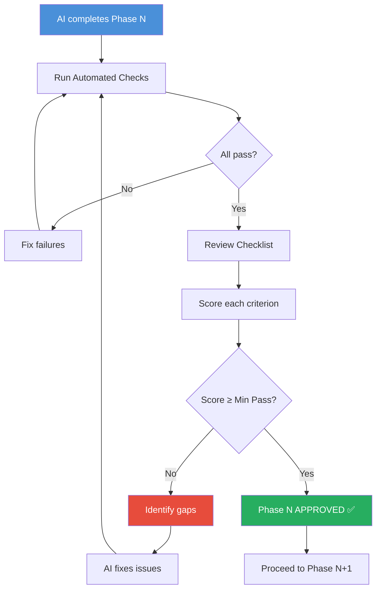

# Evaluation Rubric: The Closer
## Phase-by-Phase AI Build Evaluation — Cold Email Writer + Send Bot

> **Version:** 1.0  
> **Date:** 2026-06-01  
> **Purpose:** Evaluate each phase of the AI-built implementation against correctness, completeness, code quality, and edge case coverage.  
> **References:**  
> - [ProblemStatement.md](file:///Users/pavan2102/Documents/MacBook-Documents/Projects/Cold%20Email%20Parser/docs/ProblemStatement.md)  
> - [Architecture.md](file:///Users/pavan2102/Documents/MacBook-Documents/Projects/Cold%20Email%20Parser/docs/Architecture.md)  
> - [ImplementationPlan.md](file:///Users/pavan2102/Documents/MacBook-Documents/Projects/Cold%20Email%20Parser/docs/ImplementationPlan.md)  
> - [EdgeCases.md](file:///Users/pavan2102/Documents/MacBook-Documents/Projects/Cold%20Email%20Parser/docs/EdgeCases.md)

---

## How to Use This Document

After the AI completes each phase, run the **automated checks** and manually verify the **review checklist**. Score each criterion on a 3-point scale:

| Score | Meaning |
|-------|---------|
| ✅ **Pass** (2 pts) | Fully meets criterion; no issues |
| ⚠️ **Partial** (1 pt) | Meets criterion with minor gaps or warnings |
| ❌ **Fail** (0 pts) | Does not meet criterion; needs rework |

Each phase has a **minimum passing score**. If the score is below the threshold, the phase needs fixes before proceeding.

---

## Table of Contents

1. [Phase 1 Evaluation — Project Scaffolding](#phase-1-evaluation--project-scaffolding)
2. [Phase 2 Evaluation — Data Layer](#phase-2-evaluation--data-layer)
3. [Phase 3 Evaluation — Email Generation](#phase-3-evaluation--email-generation)
4. [Phase 4 Evaluation — Human Review](#phase-4-evaluation--human-review)
5. [Phase 5 Evaluation — Sending + Logging + Orchestration](#phase-5-evaluation--sending--logging--orchestration)
6. [Phase 6 Evaluation — Stretch Goals](#phase-6-evaluation--stretch-goals)
7. [Final MVP Evaluation](#final-mvp-evaluation)

---

## Phase 1 Evaluation — Project Scaffolding

### Automated Checks

Run these commands. All must succeed before manual review.

```bash
# AC-1.1: Project structure exists
test -f models.py && echo "PASS" || echo "FAIL: models.py missing"
test -f exceptions.py && echo "PASS" || echo "FAIL: exceptions.py missing"
test -f config.py && echo "PASS" || echo "FAIL: config.py missing"
test -f .env.example && echo "PASS" || echo "FAIL: .env.example missing"
test -f .gitignore && echo "PASS" || echo "FAIL: .gitignore missing"
test -f requirements.txt && echo "PASS" || echo "FAIL: requirements.txt missing"
test -f README.md && echo "PASS" || echo "FAIL: README.md missing"
test -d tests && echo "PASS" || echo "FAIL: tests/ directory missing"

# AC-1.2: Models are importable
python -c "from models import ContactRecord, GeneratedEmail, LogEntry, AppConfig, OutreachStatus, UserDecision, SendResult; print('PASS: All models importable')"

# AC-1.3: Exceptions are importable
python -c "from exceptions import CloserError, ConfigError, ValidationError, DeliveryError; print('PASS: All exceptions importable')"

# AC-1.4: Config loads with defaults
cp .env.example .env 2>/dev/null
python -c "from config import load_config; c = load_config(); assert c.dry_run == True; print('PASS: Config loads, dry_run=True')"

# AC-1.5: Tests pass
pytest tests/test_config.py -v
```

### Review Checklist

| # | Criterion | Category | Score | Notes |
|---|-----------|----------|-------|-------|
| 1.1 | **File structure matches plan** — all files from Phase 1 exist in correct locations | Completeness | | |
| 1.2 | **`ContactRecord` dataclass** has all 5 required fields (`recipient_email`, `company`, `role`, `candidate_name`, `candidate_background`) and 6 optional fields | Correctness | | |
| 1.3 | **Optional fields default to `None`** using `Optional[str] = None` | Correctness | | |
| 1.4 | **`OutreachStatus` enum** has all 5 values: `generated`, `drafted`, `sent`, `skipped`, `failed` | Correctness | | |
| 1.5 | **`UserDecision` enum** has at least: `send`, `skip`, `quit` | Correctness | | |
| 1.6 | **`AppConfig` has safe defaults** — `dry_run=True`, `smtp_port=587`, `smtp_host="smtp.gmail.com"` | Safety | | |
| 1.7 | **Exception hierarchy** — `ConfigError`, `ValidationError`, `DeliveryError` all inherit from `CloserError` | Architecture | | |
| 1.8 | **`load_config()` validates** — raises `ConfigError` when `DRY_RUN=false` and no SMTP creds | Correctness | | |
| 1.9 | **`load_config()` strips whitespace** from env values | Edge Case (CFG-11) | | |
| 1.10 | **Port validation** — non-integer port raises `ConfigError` | Edge Case (CFG-03) | | |
| 1.11 | **Send mode validation** — unsupported mode raises `ConfigError` | Edge Case (CFG-09) | | |
| 1.12 | **`.env.example` has all 11 variables** with safe defaults and comments | Completeness | | |
| 1.13 | **`.gitignore` includes** `.env`, `__pycache__/`, `venv/`, `*.pyc`, `outreach_log.csv` | Completeness | | |
| 1.14 | **`requirements.txt`** lists `python-dotenv>=1.0.0` | Correctness | | |
| 1.15 | **Tests exist and pass** — at least 3 test cases for `config.py` | Testing | | |
| 1.16 | **No hardcoded secrets** in any file | Safety | | |
| 1.17 | **Code uses type hints** consistently | Code Quality | | |
| 1.18 | **Docstrings present** on all public classes and functions | Code Quality | | |
| 1.19 | **No circular imports** — `models.py` and `exceptions.py` don't import from other project modules | Architecture | | |
| 1.20 | **`README.md`** has at minimum: project name, description, and setup instructions | Documentation | | |

### Scoring

| Max Score | Min Pass Score | Your Score |
|-----------|---------------|------------|
| 40 pts | 32 pts (80%) | ____ / 40 |

### Edge Cases Covered (from EdgeCases.md)

- [ ] CFG-01: Missing `.env`
- [ ] CFG-03: Non-integer port
- [ ] CFG-06: Invalid `DRY_RUN` value
- [ ] CFG-07: Missing SMTP creds in live mode
- [ ] CFG-09: Invalid send mode
- [ ] CFG-11: Whitespace in env values

---

## Phase 2 Evaluation — Data Layer

### Automated Checks

```bash
# AC-2.1: Files exist
test -f data_loader.py && echo "PASS" || echo "FAIL"
test -f contacts.json && echo "PASS" || echo "FAIL"
test -f opt_out.txt && echo "PASS" || echo "FAIL"
test -f tests/test_data_loader.py && echo "PASS" || echo "FAIL"

# AC-2.2: Sample data is valid JSON
python -c "import json; data = json.load(open('contacts.json')); assert len(data) >= 5; print(f'PASS: {len(data)} contacts loaded')"

# AC-2.3: Data loader works
python -c "
from data_loader import load_contacts
contacts = load_contacts('contacts.json')
assert len(contacts) >= 5, f'Expected >=5, got {len(contacts)}'
for c in contacts:
    assert c.recipient_email, 'Missing recipient_email'
    assert c.company, 'Missing company'
    assert c.role, 'Missing role'
print(f'PASS: {len(contacts)} valid contacts loaded')
"

# AC-2.4: Opt-out filtering works
python -c "
from data_loader import load_opt_out_list
opt_outs = load_opt_out_list()
print(f'PASS: {len(opt_outs)} opt-out emails loaded')
"

# AC-2.5: Tests pass
pytest tests/test_data_loader.py -v
```

### Review Checklist

| # | Criterion | Category | Score | Notes |
|---|-----------|----------|-------|-------|
| 2.1 | **`contacts.json` has ≥ 5 records** with realistic fake data | Completeness | | |
| 2.2 | **Mix of complete and minimal records** — at least one with only required fields | Data Quality | | |
| 2.3 | **No real email addresses** in sample data (use `@example.com`) | Safety | | |
| 2.4 | **`load_contacts()` supports JSON** — loads and returns `List[ContactRecord]` | Correctness | | |
| 2.5 | **`load_contacts()` supports CSV** — reads CSV with `DictReader` | Correctness | | |
| 2.6 | **`load_contacts()` supports hardcoded** — returns built-in sample data | Correctness | | |
| 2.7 | **Source auto-detection** works (`.json`, `.csv`, `"hardcoded"`) | Correctness | | |
| 2.8 | **Unsupported source raises `ValueError`** with clear message | Edge Case (DL-15) | | |
| 2.9 | **`validate_contact()` checks all 5 required fields** | Correctness | | |
| 2.10 | **Email format validation** — rejects strings without `@` | Edge Case (CV-03) | | |
| 2.11 | **Missing field raises `ValidationError`** with field name in message | Correctness | | |
| 2.12 | **Empty/null required fields treated as missing** | Edge Case (CV-09, CV-19, CV-20) | | |
| 2.13 | **Unknown fields in JSON are ignored** | Edge Case (CV-17) | | |
| 2.14 | **Optional fields default to `None`** when absent | Correctness | | |
| 2.15 | **`load_opt_out_list()` returns `Set[str]`** of lowercased emails | Correctness | | |
| 2.16 | **Opt-out skips comments and blank lines** | Edge Case (DL-20) | | |
| 2.17 | **Opt-out matching is case-insensitive** | Edge Case (DL-21, SG-03) | | |
| 2.18 | **Missing `opt_out.txt` returns empty set** (no crash) | Edge Case (DL-19) | | |
| 2.19 | **`filter_opt_outs()` removes matched contacts** and returns remaining | Correctness | | |
| 2.20 | **Malformed JSON raises friendly error** (not stack trace) | Edge Case (DL-05) | | |
| 2.21 | **Empty file / empty array returns empty list** | Edge Case (DL-02, DL-03) | | |
| 2.22 | **File not found raises `FileNotFoundError`** with path in message | Edge Case (DL-01) | | |
| 2.23 | **Tests cover ≥ 8 cases** including happy path, missing fields, bad email, opt-out | Testing | | |
| 2.24 | **Type hints on all public functions** | Code Quality | | |
| 2.25 | **Docstrings on all public functions** | Code Quality | | |

### Scoring

| Max Score | Min Pass Score | Your Score |
|-----------|---------------|------------|
| 50 pts | 40 pts (80%) | ____ / 50 |

### Edge Cases Covered

- [ ] DL-01: File not found
- [ ] DL-02: Empty file
- [ ] DL-03: Empty JSON array
- [ ] DL-05: Malformed JSON
- [ ] DL-15: Null/empty source string
- [ ] DL-19: Missing opt_out.txt
- [ ] DL-20: Comments in opt_out.txt
- [ ] DL-21: Case-insensitive opt-out
- [ ] CV-01: Missing required email
- [ ] CV-03: Invalid email format
- [ ] CV-09: Empty string required field
- [ ] CV-17: Unknown fields ignored
- [ ] CV-19: Null required field

---

## Phase 3 Evaluation — Email Generation

### Automated Checks

```bash
# AC-3.1: File exists
test -f email_generator.py && echo "PASS" || echo "FAIL"
test -f tests/test_email_generator.py && echo "PASS" || echo "FAIL"

# AC-3.2: Generate email for all contacts
python -c "
from data_loader import load_contacts
from email_generator import generate_email
from config import load_config

config = load_config()
contacts = load_contacts('contacts.json')
for c in contacts:
    email = generate_email(c, config)
    assert email.subject, 'Empty subject'
    assert email.body, 'Empty body'
    wc = len(email.body.split())
    assert wc <= 150, f'Body too long: {wc} words'
    assert c.company in email.body, f'Company {c.company} not in body'
    assert c.role in email.subject, f'Role {c.role} not in subject'
print(f'PASS: {len(contacts)} emails generated, all under 150 words')
"

# AC-3.3: Tests pass
pytest tests/test_email_generator.py -v
```

### Review Checklist

| # | Criterion | Category | Score | Notes |
|---|-----------|----------|-------|-------|
| 3.1 | **`generate_email()` returns `GeneratedEmail`** with subject + body + contact reference | Correctness | | |
| 3.2 | **Subject line contains role title** (e.g., "Quick note on the Backend Engineering Intern role") | Correctness | | |
| 3.3 | **Body follows 6-part structure** — greeting, personalization hook, intro, fit statement, ask, sign-off | Completeness | | |
| 3.4 | **Body is ≤ 150 words** for standard inputs | Constraint | | |
| 3.5 | **Company name appears in body** | Personalization | | |
| 3.6 | **Role title appears in body** (not just subject) | Personalization | | |
| 3.7 | **Personalization note included** when present in contact | Personalization | | |
| 3.8 | **Fallback hook used** when `personalization_note` is `None` | Edge Case (EG-03) | | |
| 3.9 | **Named greeting** when `recipient_name` is set (e.g., "Hi Priya,") | Correctness | | |
| 3.10 | **Fallback greeting** when `recipient_name` is `None` or empty (e.g., "Hi there,") | Edge Case (EG-01, EG-02) | | |
| 3.11 | **Portfolio URL in sign-off** when present | Correctness | | |
| 3.12 | **No dangling blank line** when `portfolio_url` is `None` | Edge Case (EG-05) | | |
| 3.13 | **LinkedIn/Resume links in sign-off** when present | Correctness | | |
| 3.14 | **No links section** when all link fields are `None` | Edge Case (EG-06) | | |
| 3.15 | **`template_used` field set** to `"default"` for template path | Correctness | | |
| 3.16 | **`contact` reference preserved** — `email.contact` is the same input object | Correctness | | |
| 3.17 | **Word count validation** — warns to stderr if > 150 words | Edge Case (EG-04) | | |
| 3.18 | **Email has exactly ONE ask** — not multiple questions | Quality | | |
| 3.19 | **No exaggerated claims** in template text | Safety | | |
| 3.20 | **Professional but natural tone** — reads like a human wrote it | Quality | | |
| 3.21 | **Special characters in inputs handled** (e.g., `&` in company name) | Edge Case (EG-08, EG-09) | | |
| 3.22 | **Tests cover ≥ 8 cases** including fallbacks, word count, and various input combinations | Testing | | |
| 3.23 | **Type hints and docstrings** on all functions | Code Quality | | |

### Scoring

| Max Score | Min Pass Score | Your Score |
|-----------|---------------|------------|
| 46 pts | 36 pts (78%) | ____ / 46 |

### Edge Cases Covered

- [ ] EG-01: `recipient_name` is `None`
- [ ] EG-02: `recipient_name` is empty string
- [ ] EG-03: `personalization_note` is `None`
- [ ] EG-04: Long personalization note (>150 words total)
- [ ] EG-05: `portfolio_url` is `None`
- [ ] EG-06: All link fields `None`
- [ ] EG-07: All link fields present
- [ ] EG-08: Special chars in role
- [ ] EG-10: Very short background
- [ ] EG-14: Whitespace in recipient_name

---

## Phase 4 Evaluation — Human Review

### Automated Checks

```bash
# AC-4.1: File exists
test -f previewer.py && echo "PASS" || echo "FAIL"
test -f tests/test_previewer.py && echo "PASS" || echo "FAIL"

# AC-4.2: Preview format function works
python -c "
from models import ContactRecord, GeneratedEmail
from previewer import _format_preview

contact = ContactRecord(
    recipient_email='test@example.com', company='TestCo',
    role='Engineer', candidate_name='Alex',
    candidate_background='Python dev'
)
email = GeneratedEmail(subject='Test Subject', body='Test body.', contact=contact)
preview = _format_preview(email)
assert 'test@example.com' in preview, 'Email missing from preview'
assert 'Test Subject' in preview, 'Subject missing from preview'
assert 'Test body.' in preview, 'Body missing from preview'
print('PASS: Preview format works')
"

# AC-4.3: Tests pass
pytest tests/test_previewer.py -v
```

### Review Checklist

| # | Criterion | Category | Score | Notes |
|---|-----------|----------|-------|-------|
| 4.1 | **Preview displays recipient email, company, role** | Completeness | | |
| 4.2 | **Preview displays subject line** clearly separated | Completeness | | |
| 4.3 | **Preview displays full email body** | Completeness | | |
| 4.4 | **Preview shows word count** (e.g., `87/150`) | UX | | |
| 4.5 | **Visual formatting** — uses box-drawing chars or borders for readability | UX | | |
| 4.6 | **Action prompt clearly shows options** — Send, Skip, Quit | UX | | |
| 4.7 | **`preview_and_confirm()` returns `UserDecision` enum** | Correctness | | |
| 4.8 | **"s" / "send" / "y" / "yes" → `SEND`** | Correctness | | |
| 4.9 | **"k" / "skip" / "n" / "no" → `SKIP`** | Correctness | | |
| 4.10 | **"q" / "quit" / "exit" → `QUIT`** | Correctness | | |
| 4.11 | **Input is case-insensitive** (e.g., "S", "SEND", "Yes" all work) | Edge Case (PR-03) | | |
| 4.12 | **Whitespace is stripped** from input | Edge Case (PR-04) | | |
| 4.13 | **Empty input defaults to `SKIP`** (safe default) | Edge Case (PR-01) | | |
| 4.14 | **Invalid input re-prompts** with helpful message | Edge Case (PR-02) | | |
| 4.15 | **`EOFError` (Ctrl+D) handled** → treated as `QUIT` | Edge Case (PR-05) | | |
| 4.16 | **`KeyboardInterrupt` handled** → treated as `QUIT` | Edge Case (PR-06) | | |
| 4.17 | **Tests use `mock.patch("builtins.input")`** for automation | Testing | | |
| 4.18 | **Tests cover ≥ 6 cases** including all input mappings and edge cases | Testing | | |
| 4.19 | **Type hints and docstrings** on all functions | Code Quality | | |

### Scoring

| Max Score | Min Pass Score | Your Score |
|-----------|---------------|------------|
| 38 pts | 30 pts (79%) | ____ / 38 |

### Edge Cases Covered

- [ ] PR-01: Empty input → SKIP
- [ ] PR-02: Invalid input → re-prompt
- [ ] PR-03: Uppercase input accepted
- [ ] PR-04: Whitespace stripped
- [ ] PR-05: EOF handled
- [ ] PR-06: KeyboardInterrupt handled

---

## Phase 5 Evaluation — Sending + Logging + Orchestration

### Automated Checks

```bash
# AC-5.1: Files exist
test -f email_sender.py && echo "PASS" || echo "FAIL"
test -f logger.py && echo "PASS" || echo "FAIL"
test -f main.py && echo "PASS" || echo "FAIL"
test -f tests/test_email_sender.py && echo "PASS" || echo "FAIL"
test -f tests/test_logger.py && echo "PASS" || echo "FAIL"

# AC-5.2: Dry-run mode works
python -c "
from models import ContactRecord, GeneratedEmail, OutreachStatus
from email_sender import send_email
from config import load_config

config = load_config()
assert config.dry_run == True, 'Expected dry_run=True'

contact = ContactRecord(
    recipient_email='test@example.com', company='TestCo',
    role='Engineer', candidate_name='Alex',
    candidate_background='Python dev'
)
email = GeneratedEmail(subject='Test', body='Test body', contact=contact)
result = send_email(email, config)
assert result.success == True, 'Expected success=True in dry run'
assert result.status == OutreachStatus.DRAFTED, f'Expected DRAFTED, got {result.status}'
print('PASS: Dry-run mode works')
"

# AC-5.3: Logger creates CSV
python -c "
import os, tempfile
from models import LogEntry, OutreachStatus
from logger import log_outreach, get_summary
from datetime import datetime

test_log = tempfile.mktemp(suffix='.csv')
entry = LogEntry(
    timestamp=datetime.now().isoformat(),
    recipient_email='test@example.com',
    company='TestCo', role='Engineer',
    subject='Test Subject',
    status=OutreachStatus.DRAFTED
)
log_outreach(entry, test_log)
assert os.path.exists(test_log), 'Log file not created'

summary = get_summary(test_log)
assert summary.get('drafted', 0) == 1, f'Expected 1 drafted, got {summary}'
os.unlink(test_log)
print('PASS: Logger works')
"

# AC-5.4: All tests pass
pytest tests/ -v

# AC-5.5: Main runs (dry-run, auto-skip all)
echo "k
k
k
k
k" | python main.py
echo "Exit code: $?"
```

### Review Checklist

#### Email Sender (`email_sender.py`)

| # | Criterion | Category | Score | Notes |
|---|-----------|----------|-------|-------|
| 5.1 | **`send_email()` returns `SendResult`** with success, status, and optional error | Correctness | | |
| 5.2 | **Dry-run returns `DRAFTED` status** without making SMTP connection | Correctness | | |
| 5.3 | **MIME message built correctly** — From, To, Subject, Body all set | Correctness | | |
| 5.4 | **From header uses `formataddr`** for proper name formatting | Correctness | | |
| 5.5 | **TLS/STARTTLS used** for secure connection | Security | | |
| 5.6 | **Auth failure raises `DeliveryError`** (fatal, aborts pipeline) | Edge Case (ES-04) | | |
| 5.7 | **Recipient rejected returns `FAILED`** (non-fatal, continues) | Edge Case (ES-06) | | |
| 5.8 | **Connection timeout handled** with explicit timeout value | Edge Case (ES-03) | | |
| 5.9 | **Connection uses `with` statement** for proper cleanup | Code Quality | | |
| 5.10 | **UTF-8 charset set** for non-ASCII body support | Edge Case (ES-09) | | |

#### Logger (`logger.py`)

| # | Criterion | Category | Score | Notes |
|---|-----------|----------|-------|-------|
| 5.11 | **`log_outreach()` creates CSV with headers** on first call | Correctness | | |
| 5.12 | **Subsequent calls append** without re-adding headers | Edge Case (LG-02) | | |
| 5.13 | **All 7 columns present** in correct order | Correctness | | |
| 5.14 | **`get_summary()` returns accurate counts** by status | Correctness | | |
| 5.15 | **Empty/missing file handled** in `get_summary()` | Edge Case (LG-12) | | |
| 5.16 | **Values with commas are properly quoted** | Edge Case (LG-07) | | |
| 5.17 | **Permission errors caught** and don't crash pipeline | Edge Case (LG-05) | | |

#### Orchestrator (`main.py`)

| # | Criterion | Category | Score | Notes |
|---|-----------|----------|-------|-------|
| 5.18 | **Full pipeline works end-to-end** in dry-run mode | Correctness | | |
| 5.19 | **Banner printed** with mode, contact count, log file | UX | | |
| 5.20 | **Progress indicator** shows `[1/5]`, `[2/5]`, etc. | UX | | |
| 5.21 | **QUIT stops pipeline** and logs remaining as skipped | Correctness | | |
| 5.22 | **SKIP logs as skipped** and continues | Correctness | | |
| 5.23 | **Send failures logged as FAILED** with error message | Correctness | | |
| 5.24 | **`DeliveryError` aborts pipeline** (auth failure) | Edge Case (OR-06) | | |
| 5.25 | **`KeyboardInterrupt` caught** — logs, prints summary, exits cleanly | Edge Case (OR-08) | | |
| 5.26 | **Summary printed at end** with counts per status | Completeness | | |
| 5.27 | **Zero contacts handled gracefully** | Edge Case (OR-01) | | |
| 5.28 | **Volume cap enforced** (max 10 per run) | Safety | | |
| 5.29 | **`outreach_log.csv` has correct data** after run | Correctness | | |
| 5.30 | **No hardcoded credentials** anywhere in main.py | Safety | | |

### Scoring

| Max Score | Min Pass Score | Your Score |
|-----------|---------------|------------|
| 60 pts | 48 pts (80%) | ____ / 60 |

### Edge Cases Covered

- [ ] ES-01: Dry-run mode
- [ ] ES-03: Connection timeout
- [ ] ES-04: Auth failure → abort
- [ ] ES-06: Recipient rejected → continue
- [ ] ES-09: Non-ASCII body
- [ ] LG-01: First run creates CSV
- [ ] LG-02: Append without duplicate headers
- [ ] LG-05: Permission denied on log file
- [ ] LG-12: Summary on empty file
- [ ] OR-01: Zero contacts
- [ ] OR-06: Fatal delivery error
- [ ] OR-08: KeyboardInterrupt

---

## Phase 6 Evaluation — Stretch Goals

> Score each stretch goal independently. Only evaluate goals that were actually implemented.

### 6.1 LLM Email Rewriting

| # | Criterion | Score | Notes |
|---|-----------|-------|-------|
| 6.1.1 | LLM generates subject + body from contact data | | |
| 6.1.2 | Response parsed correctly into `GeneratedEmail` | | |
| 6.1.3 | Malformed LLM response falls back to template | | |
| 6.1.4 | API timeout falls back to template | | |
| 6.1.5 | API key missing raises `ConfigError` | | |
| 6.1.6 | Word count validated on LLM output | | |
| 6.1.7 | `template_used` reflects LLM model name | | |
| **Score** | ____ / 14 | | |

### 6.2 Gmail Draft Creation

| # | Criterion | Score | Notes |
|---|-----------|-------|-------|
| 6.2.1 | OAuth flow works for Gmail API | | |
| 6.2.2 | Draft appears in Gmail Drafts folder | | |
| 6.2.3 | Draft has correct To, Subject, Body | | |
| 6.2.4 | Missing credentials handled gracefully | | |
| 6.2.5 | Token refresh works for expired tokens | | |
| **Score** | ____ / 10 | | |

### 6.3 Streamlit UI

| # | Criterion | Score | Notes |
|---|-----------|-------|-------|
| 6.3.1 | App launches with `streamlit run app.py` | | |
| 6.3.2 | File upload for contacts works (JSON/CSV) | | |
| 6.3.3 | Generated emails displayed in cards | | |
| 6.3.4 | Approve/skip buttons functional per email | | |
| 6.3.5 | Status indicators shown after send | | |
| 6.3.6 | Log displayed as table | | |
| **Score** | ____ / 12 | | |

### 6.4 Email Quality Scoring

| # | Criterion | Score | Notes |
|---|-----------|-------|-------|
| 6.4.1 | Score calculated on 0–100 scale | | |
| 6.4.2 | Rubric covers word count, personalization, ask, links, subject | | |
| 6.4.3 | Score displayed in preview | | |
| 6.4.4 | Visual bar or indicator for score | | |
| **Score** | ____ / 8 | | |

---

## Final MVP Evaluation

> Run this after Phase 5 is complete. This is the comprehensive acceptance test.

### Acceptance Criteria (from Problem Statement §17)

| # | Criterion | Evidence Required | Pass/Fail |
|---|-----------|-------------------|-----------|
| MVP-01 | App generates at least 5 personalized cold emails | Run `main.py`, observe 5 email previews | |
| MVP-02 | Each email includes subject line and body | Check each preview output | |
| MVP-03 | Each email uses company or role-specific personalization | Verify company/role appear in body | |
| MVP-04 | User can preview email before sending | Interactive confirmation prompt works | |
| MVP-05 | App can send or draft emails successfully | Dry-run shows "DRAFTED" status | |
| MVP-06 | App logs each attempt | `outreach_log.csv` has entries | |
| MVP-07 | `outreach_log.csv` has correct schema | 7 columns in correct order | |

### Code Quality Assessment

| # | Criterion | Pass/Fail | Notes |
|---|-----------|-----------|-------|
| CQ-01 | All files have docstrings explaining purpose | | |
| CQ-02 | All public functions have type hints | | |
| CQ-03 | No hardcoded secrets or real emails | | |
| CQ-04 | Consistent code style (PEP 8) | | |
| CQ-05 | Error messages are user-friendly (no raw tracebacks for expected errors) | | |
| CQ-06 | All tests pass: `pytest tests/ -v` | | |
| CQ-07 | Test coverage ≥ 70%: `pytest tests/ --cov=. --cov-report=term-missing` | | |

### Safety Assessment

| # | Criterion | Pass/Fail | Notes |
|---|-----------|-----------|-------|
| SA-01 | `DRY_RUN=true` by default | | |
| SA-02 | Human review required before any send | | |
| SA-03 | Volume cap enforced (≤ 10 per run) | | |
| SA-04 | Opt-out filtering works | | |
| SA-05 | Sender identity matches SMTP_USER | | |
| SA-06 | No spam-like language in templates | | |
| SA-07 | Full audit trail in CSV | | |

### Architecture Assessment

| # | Criterion | Pass/Fail | Notes |
|---|-----------|-----------|-------|
| AR-01 | Modules match architecture doc (7 files) | | |
| AR-02 | Each module has single responsibility | | |
| AR-03 | No circular imports | | |
| AR-04 | Data models shared via `models.py` | | |
| AR-05 | Exceptions shared via `exceptions.py` | | |
| AR-06 | Config drives all behavior (no magic constants) | | |

### Final Score Card

| Category | Max Points | Your Score | Percentage |
|----------|-----------|------------|------------|
| Phase 1 — Scaffolding | 40 | | |
| Phase 2 — Data Layer | 50 | | |
| Phase 3 — Email Generation | 46 | | |
| Phase 4 — Human Review | 38 | | |
| Phase 5 — Sending + Logging | 60 | | |
| MVP Acceptance | 14 | | |
| Code Quality | 14 | | |
| Safety | 14 | | |
| Architecture | 12 | | |
| **TOTAL** | **288** | | |

### Grade Scale

| Grade | Score Range | Meaning |
|-------|-----------|---------|
| 🏆 **A — Exceptional** | 260–288 (90%+) | Production-ready; all edge cases handled |
| ✅ **B — Solid** | 230–259 (80%+) | Fully functional MVP; minor gaps |
| ⚠️ **C — Acceptable** | 200–229 (70%+) | Works for demo; some edge cases missing |
| 🔧 **D — Needs Work** | 170–199 (60%+) | Core works but significant gaps |
| ❌ **F — Incomplete** | < 170 (<60%) | Major modules missing or broken |

---

## Appendix: Evaluation Workflow



### Per-Phase Evaluation Checklist

```text
□ Run automated checks (all must pass)
□ Walk through review checklist
□ Score each criterion (✅/⚠️/❌)
□ Calculate total score
□ Verify ≥ minimum passing score
□ Check edge case coverage list
□ Note any gaps or concerns
□ Approve or request fixes
```

---

> **Note:** This rubric is designed to be strict but fair. The minimum passing scores (78–80%) allow for reasonable omissions while ensuring the core functionality and safety properties are solid.
