# Implementation Plan: The Closer
## Phase-Wise Build Guide — Cold Email Writer + Send Bot

> **Version:** 1.0  
> **Date:** 2026-06-01  
> **Source Documents:**  
> - [ProblemStatement.md](file:///Users/pavan2102/Documents/MacBook-Documents/Projects/Cold%20Email%20Parser/docs/ProblemStatement.md)  
> - [Architecture.md](file:///Users/pavan2102/Documents/MacBook-Documents/Projects/Cold%20Email%20Parser/docs/Architecture.md)

---

## Overview

This plan breaks the project into **6 sequential phases**, each producing a working increment. Every phase ends with a testable checkpoint so progress is never lost.

### Phase Map

```mermaid
gantt
    title The Closer — Implementation Phases
    dateFormat  X
    axisFormat  Phase %s

    section Foundation
    Phase 1 - Project Scaffolding       :p1, 0, 1
    
    section Core Pipeline
    Phase 2 - Data Layer                :p2, 1, 2
    Phase 3 - Email Generation          :p3, 2, 3
    Phase 4 - Human Review              :p4, 3, 4
    
    section Delivery
    Phase 5 - Email Sending + Logging   :p5, 4, 5
    
    section Enhancement
    Phase 6 - Stretch Goals             :p6, 5, 6
```



### Quick Reference

| Phase | Name | Files Created / Modified | Est. Time |
|-------|------|--------------------------|-----------|
| 1 | Project Scaffolding | `models.py`, `exceptions.py`, `config.py`, `.env.example`, `.gitignore`, `requirements.txt`, `README.md` | 30–45 min |
| 2 | Data Layer | `data_loader.py`, `contacts.json`, `opt_out.txt`, `tests/test_data_loader.py` | 30–45 min |
| 3 | Email Generation | `email_generator.py`, `tests/test_email_generator.py` | 30–45 min |
| 4 | Human Review | `previewer.py`, `tests/test_previewer.py` | 20–30 min |
| 5 | Sending + Logging + Orchestration | `email_sender.py`, `logger.py`, `main.py`, `tests/test_email_sender.py`, `tests/test_logger.py` | 45–60 min |
| 6 | Stretch Goals | LLM rewriting, Gmail draft mode, Streamlit UI, quality scoring | Variable |

**Total MVP (Phases 1–5): ~2.5–4 hours**

---

## Phase 1: Project Scaffolding & Configuration

### Goal
Set up the project skeleton, data models, configuration system, and exception hierarchy. After this phase, the project has a clean structure, typed models, and can load configuration from `.env`.

### Dependency Chain
```
Phase 1 has NO upstream dependencies — this is the starting point.
```

### Tasks

#### 1.1 Initialize project structure

```text
the-closer/
├── main.py              (placeholder: print("The Closer — coming soon"))
├── config.py
├── models.py
├── exceptions.py
├── .env.example
├── .env                 (git-ignored, copied from .env.example)
├── .gitignore
├── requirements.txt
├── requirements-dev.txt
├── README.md
├── tests/
│   └── __init__.py
└── docs/
    ├── ProblemStatement.md
    ├── Architecture.md
    └── ImplementationPlan.md
```

#### 1.2 Create `models.py`

Define all shared data classes used across the system:

| Data Class | Purpose | Reference |
|-----------|---------|-----------|
| `ContactRecord` | Represents one outreach target with required + optional fields | [Architecture §5.1](file:///Users/pavan2102/Documents/MacBook-Documents/Projects/Cold%20Email%20Parser/docs/Architecture.md#L146) |
| `GeneratedEmail` | Holds subject + body + reference to contact | [Architecture §5.2](file:///Users/pavan2102/Documents/MacBook-Documents/Projects/Cold%20Email%20Parser/docs/Architecture.md#L172) |
| `LogEntry` | Single row for `outreach_log.csv` | [Architecture §5.3](file:///Users/pavan2102/Documents/MacBook-Documents/Projects/Cold%20Email%20Parser/docs/Architecture.md#L185) |
| `AppConfig` | Typed representation of `.env` settings | [Architecture §5.4](file:///Users/pavan2102/Documents/MacBook-Documents/Projects/Cold%20Email%20Parser/docs/Architecture.md#L211) |
| `SendResult` | Return type from email sender | [Architecture §7.5](file:///Users/pavan2102/Documents/MacBook-Documents/Projects/Cold%20Email%20Parser/docs/Architecture.md#L526) |
| `OutreachStatus` | Enum: `generated`, `drafted`, `sent`, `skipped`, `failed` | [Architecture §5.3](file:///Users/pavan2102/Documents/MacBook-Documents/Projects/Cold%20Email%20Parser/docs/Architecture.md#L191) |
| `UserDecision` | Enum: `send`, `skip`, `quit`, `edit` | [Architecture §7.4](file:///Users/pavan2102/Documents/MacBook-Documents/Projects/Cold%20Email%20Parser/docs/Architecture.md#L474) |

**Implementation notes:**
- Use `@dataclass` from stdlib
- Use `Optional[str]` for optional fields (default `None`)
- Use `Enum` for status types
- All required fields of `ContactRecord`: `recipient_email`, `company`, `role`, `candidate_name`, `candidate_background`

#### 1.3 Create `exceptions.py`

Define the custom exception hierarchy:

```python
CloserError (base)
├── ConfigError          # Missing/invalid .env values
├── ValidationError      # Bad contact data
└── DeliveryError        # SMTP/API send failures
```

Reference: [Architecture §9.3](file:///Users/pavan2102/Documents/MacBook-Documents/Projects/Cold%20Email%20Parser/docs/Architecture.md#L729)

#### 1.4 Create `config.py`

| Function | What It Does |
|----------|-------------|
| `load_config(env_path=".env")` | Loads `.env` via `python-dotenv`, maps vars to `AppConfig`, validates |

**Validation rules to implement:**
- If `DRY_RUN=false` → `SMTP_USER` and `SMTP_PASSWORD` must be non-empty
- `SMTP_PORT` must parse as `int`
- `SEND_MODE` must be in `{"smtp", "gmail_api", "sendgrid", "resend"}`
- Raise `ConfigError` with helpful messages on failure

Reference: [Architecture §7.1](file:///Users/pavan2102/Documents/MacBook-Documents/Projects/Cold%20Email%20Parser/docs/Architecture.md#L362) and [§8](file:///Users/pavan2102/Documents/MacBook-Documents/Projects/Cold%20Email%20Parser/docs/Architecture.md#L635)

#### 1.5 Create support files

| File | Contents |
|------|----------|
| `.env.example` | All 11 env vars with safe defaults (`DRY_RUN=true`) |
| `.gitignore` | `.env`, `__pycache__/`, `venv/`, `*.pyc`, `outreach_log.csv` |
| `requirements.txt` | `python-dotenv>=1.0.0` |
| `requirements-dev.txt` | Adds `pytest>=7.0.0`, `pytest-cov>=4.0.0` |
| `README.md` | Project name, description, setup steps, usage |

#### 1.6 Write `tests/test_config.py`

| Test Case | Asserts |
|-----------|---------|
| `test_load_valid_config` | Returns `AppConfig` with correct values |
| `test_dry_run_defaults_true` | `config.dry_run` is `True` when not set |
| `test_missing_smtp_creds_live_mode` | Raises `ConfigError` when `DRY_RUN=false` and creds missing |
| `test_invalid_port` | Raises `ConfigError` for non-integer port |
| `test_invalid_send_mode` | Raises `ConfigError` for unknown mode |

### Deliverables
- [x] All data models importable from `models.py`
- [x] Config loads from `.env` and validates
- [x] Exception hierarchy defined
- [x] Tests pass: `pytest tests/test_config.py -v`

### Checkpoint ✅
```bash
# Verify Phase 1
python -c "from models import ContactRecord, GeneratedEmail, LogEntry, AppConfig; print('Models OK')"
python -c "from config import load_config; c = load_config(); print(f'Config OK: dry_run={c.dry_run}')"
pytest tests/test_config.py -v
```

---

## Phase 2: Data Layer — Contact Ingestion

### Goal
Build the data loading and validation system. After this phase, the app can load contacts from JSON, CSV, or hardcoded data, validate them, and filter out opt-out recipients.

### Dependency Chain
```
Phase 1 (models.py, exceptions.py) → Phase 2
```

### Tasks

#### 2.1 Create `contacts.json` — Sample data

Create 5 sample outreach targets (per [ProblemStatement §14](file:///Users/pavan2102/Documents/MacBook-Documents/Projects/Cold%20Email%20Parser/docs/ProblemStatement.md#L385)):

```json
[
  {
    "recipient_name": "Priya Sharma",
    "recipient_email": "priya@example.com",
    "company": "Acme AI",
    "role": "Backend Engineering Intern",
    "job_url": "https://example.com/job/acme-ai",
    "personalization_note": "Company recently launched an AI workflow automation product",
    "candidate_name": "Alex Chen",
    "candidate_background": "Python developer interested in automation and AI agents",
    "portfolio_url": "https://github.com/alexchen"
  },
  // ... 4 more records with varied companies, roles, and personalization
]
```

**Requirements:**
- At least 5 records
- Mix of complete records (all optional fields) and minimal records (only required fields)
- Realistic but fake data (no real emails)
- Include one record with a missing optional field to test fallbacks

#### 2.2 Create `opt_out.txt`

```text
# Emails of people who have asked not to be contacted
# One email per line
do-not-contact@example.com
```

Reference: [Architecture §10.3](file:///Users/pavan2102/Documents/MacBook-Documents/Projects/Cold%20Email%20Parser/docs/Architecture.md#L784)

#### 2.3 Create `data_loader.py`

| Function | Signature | What It Does |
|----------|-----------|-------------|
| `load_contacts` | `(source: str) -> List[ContactRecord]` | Auto-detects `.json` / `.csv` / `"hardcoded"` and dispatches |
| `validate_contact` | `(data: dict) -> ContactRecord` | Checks required fields, validates email format, returns typed record |
| `load_opt_out_list` | `(path: str = "opt_out.txt") -> Set[str]` | Reads opt-out file, returns set of lowercased emails |
| `filter_opt_outs` | `(contacts, opt_outs) -> List[ContactRecord]` | Removes contacts whose email is in the opt-out set |
| `_load_from_json` | `(path: str) -> List[dict]` | Reads JSON array from file |
| `_load_from_csv` | `(path: str) -> List[dict]` | Reads CSV rows as dicts |
| `_load_hardcoded` | `() -> List[dict]` | Returns built-in sample data |

**Validation rules:**
- Required fields: `recipient_email`, `company`, `role`, `candidate_name`, `candidate_background`
- `recipient_email` must match basic email regex pattern `^[^@]+@[^@]+\.[^@]+$`
- Raise `ValidationError` with field name on failure
- Log a warning for invalid records, don't crash the pipeline

**Source detection logic:**
```
source.endswith(".json")  →  _load_from_json
source.endswith(".csv")   →  _load_from_csv
source == "hardcoded"     →  _load_hardcoded
otherwise                 →  raise ValueError("Unsupported source")
```

Reference: [Architecture §7.2](file:///Users/pavan2102/Documents/MacBook-Documents/Projects/Cold%20Email%20Parser/docs/Architecture.md#L387)

#### 2.4 Write `tests/test_data_loader.py`

| Test Case | Asserts |
|-----------|---------|
| `test_load_valid_json` | Returns `List[ContactRecord]` with correct count |
| `test_load_valid_csv` | CSV path produces same structure as JSON |
| `test_load_hardcoded` | Hardcoded source returns non-empty list |
| `test_missing_required_field` | `ValidationError` raised when `recipient_email` missing |
| `test_invalid_email_format` | `ValidationError` raised for malformed email |
| `test_optional_fields_default_none` | Optional fields are `None` when absent |
| `test_opt_out_filtering` | Contacts in opt-out list are removed |
| `test_opt_out_case_insensitive` | `Priya@Example.com` matches `priya@example.com` in opt-out |
| `test_empty_file` | Returns empty list, no crash |
| `test_unsupported_source` | `ValueError` raised for `.txt` source |

### Deliverables
- [x] 5 sample contacts in `contacts.json`
- [x] `data_loader.py` loads from JSON, CSV, and hardcoded
- [x] Validation catches missing fields and bad emails
- [x] Opt-out filtering works
- [x] All tests pass

### Checkpoint ✅
```bash
# Verify Phase 2
python -c "
from data_loader import load_contacts
contacts = load_contacts('contacts.json')
print(f'Loaded {len(contacts)} contacts')
for c in contacts:
    print(f'  → {c.recipient_email} @ {c.company} — {c.role}')
"
pytest tests/test_data_loader.py -v
```

---

## Phase 3: Email Generation

### Goal
Build the email composition engine. After this phase, the system can take a contact record and produce a personalized subject line and email body following the cold email structure defined in the problem statement.

### Dependency Chain
```
Phase 1 (models.py) → Phase 3
Phase 2 (data_loader.py — for integration testing) → Phase 3
```

### Tasks

#### 3.1 Create `email_generator.py`

| Function | Signature | What It Does |
|----------|-----------|-------------|
| `generate_email` | `(contact: ContactRecord, config: AppConfig) -> GeneratedEmail` | Main entry point; routes to template or LLM |
| `_generate_from_template` | `(contact: ContactRecord) -> GeneratedEmail` | F-string based deterministic template |
| `_validate_word_count` | `(body: str, limit: int = 150) -> bool` | Checks body is under word limit |

**Template Implementation (MVP):**

The template must follow the **Email Anatomy** from [ProblemStatement §7](file:///Users/pavan2102/Documents/MacBook-Documents/Projects/Cold%20Email%20Parser/docs/ProblemStatement.md#L129):

```
Section 1 — Subject Line
  → "Quick note on the {role} role"

Section 2 — Personalization Hook
  → "I noticed {company} is hiring for {role}. {personalization_note}"
  → Fallback if no personalization_note: "I came across the {role} position and it caught my attention."

Section 3 — Relevant Introduction
  → "I'm {candidate_name}, and I've been building projects around {candidate_background}."

Section 4 — Value / Fit Statement
  → "The role stood out because it connects closely with my interest in practical automation and product-focused engineering."

Section 5 — One Clear Ask
  → "Would you be open to a quick look at my profile or pointing me to the right person?"

Section 6 — Sign-Off
  → "Best,\n{candidate_name}"
  → Append portfolio_url, linkedin_url, resume_link if available
```

**Greeting logic:**
```
If recipient_name is set → "Hi {recipient_name},"
Else                     → "Hi there,"
```

**Constraints to enforce:**
- Body ≤ 150 words (warn to stderr if exceeded, do NOT block)
- No exaggerated claims in template text
- Only one ask per email
- Professional but natural tone

Reference: [Architecture §7.3](file:///Users/pavan2102/Documents/MacBook-Documents/Projects/Cold%20Email%20Parser/docs/Architecture.md#L417) and [ProblemStatement §7](file:///Users/pavan2102/Documents/MacBook-Documents/Projects/Cold%20Email%20Parser/docs/ProblemStatement.md#L129)

#### 3.2 Write `tests/test_email_generator.py`

| Test Case | Asserts |
|-----------|---------|
| `test_generates_subject_with_role` | Subject contains the role title |
| `test_generates_body_with_company` | Body contains company name |
| `test_body_under_150_words` | `len(body.split()) <= 150` |
| `test_personalization_note_included` | When note provided, it appears in body |
| `test_fallback_when_no_personalization_note` | Generic hook used when field is `None` |
| `test_recipient_name_greeting` | "Hi Priya," when name is provided |
| `test_fallback_greeting` | "Hi there," when name is `None` |
| `test_portfolio_url_in_signoff` | URL appears at end when provided |
| `test_no_portfolio_url` | No dangling line when `portfolio_url` is `None` |
| `test_template_used_field` | `email.template_used == "default"` |
| `test_contact_reference_preserved` | `email.contact` is the same input object |

#### 3.3 Integration test: Load → Generate

```python
def test_full_generation_pipeline():
    """Load contacts from JSON, generate emails for all, verify all succeed."""
    contacts = load_contacts("contacts.json")
    config = load_config()
    for contact in contacts:
        email = generate_email(contact, config)
        assert email.subject
        assert email.body
        assert len(email.body.split()) <= 150
```

### Deliverables
- [x] Template-based email generation works for all contact variations
- [x] Graceful fallbacks for missing optional fields
- [x] Word count validation
- [x] All tests pass

### Checkpoint ✅
```bash
# Verify Phase 3
python -c "
from data_loader import load_contacts
from email_generator import generate_email
from config import load_config

config = load_config()
contacts = load_contacts('contacts.json')

for c in contacts:
    email = generate_email(c, config)
    word_count = len(email.body.split())
    print(f'[{word_count}w] {email.subject}')
    print(email.body[:100] + '...')
    print('---')
"
pytest tests/test_email_generator.py -v
```

---

## Phase 4: Human Review — Preview & Confirmation

### Goal
Build the terminal-based email preview and user confirmation flow. After this phase, the user can see a formatted preview of each email and decide to send, skip, or quit.

### Dependency Chain
```
Phase 1 (models.py) → Phase 4
Phase 3 (email_generator.py — for visual testing) → Phase 4
```

### Tasks

#### 4.1 Create `previewer.py`

| Function | Signature | What It Does |
|----------|-----------|-------------|
| `preview_and_confirm` | `(email: GeneratedEmail) -> UserDecision` | Shows preview, collects input, returns decision |
| `_format_preview` | `(email: GeneratedEmail) -> str` | Builds the decorated terminal output string |
| `_get_user_input` | `() -> UserDecision` | Reads stdin, maps to `UserDecision` enum |

**Terminal Preview Format:**

```
══════════════════════════════════════════════════════════
  📧  EMAIL PREVIEW  [1/5]
══════════════════════════════════════════════════════════
  To:      priya@example.com
  Company: Acme AI
  Role:    Backend Engineering Intern
──────────────────────────────────────────────────────────
  Subject: Quick note on the Backend Engineering Intern role
──────────────────────────────────────────────────────────

  Hi Priya,

  I noticed Acme AI is hiring for Backend Engineering Intern.
  Company recently launched an AI workflow automation product.

  I'm Alex Chen, and I've been building projects around
  Python development, automation and AI agents.
  The role stood out because it connects closely with my
  interest in practical automation and product-focused engineering.

  Would you be open to a quick look at my profile or
  pointing me to the right person?

  Best,
  Alex Chen
  https://github.com/alexchen

══════════════════════════════════════════════════════════
  Word count: 87/150
══════════════════════════════════════════════════════════
  [S]end  |  S[k]ip  |  [Q]uit
  ❯
```

**Input mapping:**
```
"s" or "send" or "y" or "yes"  → UserDecision.SEND
"k" or "skip" or "n" or "no"  → UserDecision.SKIP
"q" or "quit" or "exit"       → UserDecision.QUIT
anything else                  → Print "Invalid choice", re-prompt
```

**Design decisions:**
- Use Unicode box-drawing characters for visual polish
- Show word count as `{current}/{limit}` for transparency
- Accept case-insensitive input
- Default to `SKIP` if user just presses Enter (safe default)

Reference: [Architecture §7.4](file:///Users/pavan2102/Documents/MacBook-Documents/Projects/Cold%20Email%20Parser/docs/Architecture.md#L454) and [ProblemStatement §FR3](file:///Users/pavan2102/Documents/MacBook-Documents/Projects/Cold%20Email%20Parser/docs/ProblemStatement.md#L225)

#### 4.2 Write `tests/test_previewer.py`

| Test Case | Asserts |
|-----------|---------|
| `test_format_preview_contains_recipient` | Preview string contains recipient email |
| `test_format_preview_contains_subject` | Preview string contains subject line |
| `test_format_preview_contains_body` | Preview string contains email body text |
| `test_format_preview_shows_word_count` | Preview contains word count display |
| `test_send_input_mapping` | "s", "send", "y", "yes" all → `SEND` |
| `test_skip_input_mapping` | "k", "skip", "n", "no" all → `SKIP` |
| `test_quit_input_mapping` | "q", "quit", "exit" all → `QUIT` |
| `test_case_insensitive` | "S", "SEND", "Yes" all work |
| `test_empty_input_defaults_skip` | Empty string → `SKIP` |

**Testing approach:** Use `unittest.mock.patch("builtins.input")` to simulate user input.

#### 4.3 Manual visual test

Run the preview formatter on all 5 sample contacts and visually verify the output looks clean:

```bash
python -c "
from data_loader import load_contacts
from email_generator import generate_email
from previewer import _format_preview
from config import load_config

config = load_config()
for c in load_contacts('contacts.json'):
    email = generate_email(c, config)
    print(_format_preview(email))
"
```

### Deliverables
- [x] Formatted email previews display in terminal
- [x] User can send, skip, or quit per email
- [x] Input is case-insensitive with safe defaults
- [x] All tests pass

### Checkpoint ✅
```bash
# Verify Phase 4 (automated)
pytest tests/test_previewer.py -v

# Verify Phase 4 (manual — interactive)
python -c "
from models import ContactRecord, GeneratedEmail
from previewer import preview_and_confirm

test_contact = ContactRecord(
    recipient_email='test@example.com',
    company='TestCo',
    role='Software Engineer',
    candidate_name='Alex',
    candidate_background='Python developer'
)
test_email = GeneratedEmail(
    subject='Quick note on the Software Engineer role',
    body='Hi there,\n\nTest email body.\n\nBest,\nAlex',
    contact=test_contact
)
decision = preview_and_confirm(test_email)
print(f'Decision: {decision}')
"
```

---

## Phase 5: Email Sending, Logging & Orchestration

### Goal
Build the email delivery system, CSV logger, and the main orchestrator that ties everything together. After this phase, **the MVP is complete** — the app can load contacts, generate emails, preview them, send/draft via SMTP, and log every action.

### Dependency Chain
```
Phase 1 (models.py, config.py, exceptions.py) ─┐
Phase 2 (data_loader.py)                        ├──→ Phase 5
Phase 3 (email_generator.py)                    │
Phase 4 (previewer.py)                         ─┘
```

### Tasks

#### 5.1 Create `email_sender.py`

| Function | Signature | What It Does |
|----------|-----------|-------------|
| `send_email` | `(email: GeneratedEmail, config: AppConfig) -> SendResult` | Main entry; routes based on `config.send_mode` and `config.dry_run` |
| `_send_via_smtp` | `(email: GeneratedEmail, config: AppConfig) -> SendResult` | Builds MIME message, connects via TLS, sends |
| `_build_mime_message` | `(email, config) -> MIMEMultipart` | Constructs the email MIME object |

**SMTP Send Flow (MVP):**

```python
def _send_via_smtp(email, config):
    # 1. Build MIME message
    msg = _build_mime_message(email, config)
    
    # 2. Check dry-run mode
    if config.dry_run:
        return SendResult(success=True, status=OutreachStatus.DRAFTED)
    
    # 3. Connect and send
    try:
        with smtplib.SMTP(config.smtp_host, config.smtp_port) as server:
            server.ehlo()
            server.starttls()
            server.ehlo()
            server.login(config.smtp_user, config.smtp_password)
            server.sendmail(
                config.smtp_user,
                email.contact.recipient_email,
                msg.as_string()
            )
        return SendResult(success=True, status=OutreachStatus.SENT)
    except smtplib.SMTPAuthenticationError as e:
        raise DeliveryError(f"Authentication failed: {e}")
    except smtplib.SMTPException as e:
        return SendResult(success=False, status=OutreachStatus.FAILED, error_message=str(e))
```

**Key error handling:**
- `SMTPAuthenticationError` → Raise `DeliveryError` (fatal — abort pipeline)
- `SMTPConnectError` → Return `SendResult(failed)` (continue to next contact)
- `SMTPRecipientsRefused` → Return `SendResult(failed)` (continue)
- All other `SMTPException` → Return `SendResult(failed)` (continue)

**MIME message construction:**
- `From`: `"{sender_name}" <{smtp_user}>`
- `To`: `recipient_email`
- `Subject`: `email.subject`
- Body: `MIMEText(email.body, "plain")`
- Add `Reply-To` header = `smtp_user`

Reference: [Architecture §7.5](file:///Users/pavan2102/Documents/MacBook-Documents/Projects/Cold%20Email%20Parser/docs/Architecture.md#L506)

#### 5.2 Create `logger.py`

| Function | Signature | What It Does |
|----------|-----------|-------------|
| `log_outreach` | `(entry: LogEntry, log_file: str = "outreach_log.csv") -> None` | Appends one row to CSV; creates file with headers if new |
| `get_summary` | `(log_file: str = "outreach_log.csv") -> dict` | Reads CSV, returns `{"sent": N, "drafted": N, ...}` counts |

**CSV columns (in order):**
```
timestamp, recipient_email, company, role, subject, status, error_message
```

**Implementation details:**
- Use `csv.DictWriter` for writing
- Use `os.path.exists()` to determine if headers are needed
- Timestamps in ISO 8601 format: `datetime.now().isoformat()`
- `error_message` can be empty string for successful entries
- File encoding: UTF-8

Reference: [Architecture §7.6](file:///Users/pavan2102/Documents/MacBook-Documents/Projects/Cold%20Email%20Parser/docs/Architecture.md#L551)

#### 5.3 Create `main.py` — The Orchestrator

This is the heart of the application. It ties all modules together.

**Complete flow:**

```python
def main():
    """The Closer — Cold Email Writer + Send Bot."""
    
    # ── Step 1: Load Config ──
    try:
        config = load_config()
    except ConfigError as e:
        print(f"❌ Configuration error: {e}")
        sys.exit(1)
    
    # ── Step 2: Load Contacts ──
    try:
        contacts = load_contacts(config.input_file)
        opt_outs = load_opt_out_list()
        contacts = filter_opt_outs(contacts, opt_outs)
    except (FileNotFoundError, ValueError) as e:
        print(f"❌ Data error: {e}")
        sys.exit(1)
    
    if not contacts:
        print("No contacts to process. Exiting.")
        sys.exit(0)
    
    # ── Step 3: Print Banner ──
    print_banner(config, len(contacts))
    
    # ── Step 4: Pipeline Loop ──
    stats = {"sent": 0, "drafted": 0, "skipped": 0, "failed": 0}
    
    for i, contact in enumerate(contacts, 1):
        print(f"\n[{i}/{len(contacts)}] Processing: {contact.company} — {contact.role}")
        
        # Generate email
        email = generate_email(contact, config)
        
        # Preview and get confirmation
        decision = preview_and_confirm(email)
        
        if decision == UserDecision.QUIT:
            # Log remaining as skipped
            log_outreach(make_log_entry(email, OutreachStatus.SKIPPED), config.log_file)
            stats["skipped"] += 1
            print("\n👋 Quitting. Remaining contacts skipped.")
            break
        
        if decision == UserDecision.SKIP:
            log_outreach(make_log_entry(email, OutreachStatus.SKIPPED), config.log_file)
            stats["skipped"] += 1
            continue
        
        # Send / Draft
        try:
            result = send_email(email, config)
            log_outreach(make_log_entry(email, result.status, result.error_message), config.log_file)
            stats[result.status.value] += 1
            
            if result.success:
                status_icon = "📤" if result.status == OutreachStatus.SENT else "📝"
                print(f"  {status_icon} {result.status.value.upper()}")
            else:
                print(f"  ❌ Failed: {result.error_message}")
        
        except DeliveryError as e:
            print(f"\n🚨 Fatal delivery error: {e}")
            print("Aborting pipeline — please check your SMTP credentials.")
            break
    
    # ── Step 5: Summary ──
    print_summary(stats, config.log_file)
```

**Helper functions in `main.py`:**

| Function | What It Does |
|----------|-------------|
| `print_banner(config, count)` | Prints app name, mode (dry/live), contact count |
| `print_summary(stats, log_file)` | Prints final tally and log file location |
| `make_log_entry(email, status, error)` | Creates a `LogEntry` from email + status |

**Banner example:**
```
╔══════════════════════════════════════════╗
║         🎯 THE CLOSER v1.0              ║
║      Cold Email Writer + Send Bot       ║
╠══════════════════════════════════════════╣
║  Mode:     DRY RUN (no emails sent)     ║
║  Contacts: 5                            ║
║  Log file: outreach_log.csv             ║
╚══════════════════════════════════════════╝
```

**Summary example:**
```
══════════════════════════════════════════════
  📊 OUTREACH SUMMARY
──────────────────────────────────────────────
  📤 Sent:     0
  📝 Drafted:  3
  ⏭️  Skipped:  1
  ❌ Failed:   1
──────────────────────────────────────────────
  📄 Full log: outreach_log.csv
══════════════════════════════════════════════
```

Reference: [Architecture §7.7](file:///Users/pavan2102/Documents/MacBook-Documents/Projects/Cold%20Email%20Parser/docs/Architecture.md#L579) and [ProblemStatement §16](file:///Users/pavan2102/Documents/MacBook-Documents/Projects/Cold%20Email%20Parser/docs/ProblemStatement.md#L416)

#### 5.4 Write `tests/test_email_sender.py`

| Test Case | Asserts |
|-----------|---------|
| `test_dry_run_returns_drafted` | `result.status == DRAFTED` and `result.success == True` |
| `test_dry_run_no_smtp_connection` | No actual SMTP call made (mock verify) |
| `test_mime_message_headers` | From, To, Subject headers set correctly |
| `test_mime_message_body` | Body content matches `email.body` |
| `test_smtp_auth_error_raises_delivery_error` | `DeliveryError` raised on auth failure |
| `test_smtp_send_error_returns_failed` | Returns `SendResult(failed)` on send error |

**Testing approach:** Use `unittest.mock.patch("smtplib.SMTP")` to mock the SMTP server.

#### 5.5 Write `tests/test_logger.py`

| Test Case | Asserts |
|-----------|---------|
| `test_creates_csv_with_headers` | New file has correct header row |
| `test_appends_without_duplicate_headers` | Second write doesn't re-add headers |
| `test_log_entry_fields` | All 7 columns present with correct values |
| `test_get_summary_counts` | Correct counts per status |
| `test_empty_log_summary` | Returns all zeros for empty/missing file |

#### 5.6 End-to-end dry-run test

```python
def test_e2e_dry_run():
    """Full pipeline in dry-run mode produces drafted statuses."""
    # This test mocks user input to auto-send all
    # Verifies outreach_log.csv has 5 'drafted' entries
```

### Deliverables
- [x] Emails can be sent via SMTP (or drafted in dry-run mode)
- [x] Every action logged to `outreach_log.csv`
- [x] `main.py` orchestrates the full pipeline
- [x] Summary statistics printed at end
- [x] All tests pass
- [x] **MVP IS COMPLETE** 🎉

### Checkpoint ✅
```bash
# Verify Phase 5 — Full MVP test (dry-run)
python main.py

# Verify tests
pytest tests/ -v --cov=. --cov-report=term-missing

# Verify log file was created
cat outreach_log.csv

# (Optional) Test with real email to yourself
# Edit .env: DRY_RUN=false, set real SMTP creds
# Edit contacts.json: set recipient_email to your own email
# python main.py
```

### Acceptance Criteria (from [ProblemStatement §17](file:///Users/pavan2102/Documents/MacBook-Documents/Projects/Cold%20Email%20Parser/docs/ProblemStatement.md#L460))

| Criterion | Status |
|-----------|--------|
| App generates at least 5 personalized cold emails | ✅ |
| Each email includes subject line and body | ✅ |
| Each email uses company or role-specific personalization | ✅ |
| User can preview email before sending | ✅ |
| App can send or draft emails successfully | ✅ |
| App logs each attempt | ✅ |
| Proof available via outreach_log.csv + sent/drafted folder | ✅ |

---

## Phase 6: Stretch Goals

### Goal
Enhance the MVP with optional features. Each stretch goal is independent and can be implemented in any order.

### Dependency Chain
```
Phase 5 (complete MVP) → Phase 6 (any stretch goal)
```

---

### 6.1 🧠 LLM-Powered Email Rewriting

**Priority:** High — significantly improves email quality

**Files modified:** `email_generator.py`, `config.py`, `requirements.txt`

**Implementation:**

```python
def _generate_with_llm(contact: ContactRecord, api_key: str) -> GeneratedEmail:
    """Use Groq (Llama 3.3 / Mixtral) to generate a polished cold email."""
    
    prompt = f"""Write a cold outreach email for a job opportunity.

    Recipient: {contact.recipient_name or 'Hiring Manager'} at {contact.company}
    Role: {contact.role}
    About the company: {contact.personalization_note or 'N/A'}
    
    Candidate: {contact.candidate_name}
    Background: {contact.candidate_background}
    Portfolio: {contact.portfolio_url or 'N/A'}
    
    Requirements:
    - Under 150 words
    - Include a personalization hook about the company
    - One clear ask (quick chat or referral)
    - Professional but natural tone
    - No exaggerated claims
    
    Return format:
    SUBJECT: <subject line>
    BODY:
    <email body>
    """
    
    # Call Groq API
    from groq import Groq
    client = Groq(api_key=api_key)
    chat_completion = client.chat.completions.create(
        messages=[{"role": "user", "content": prompt}],
        model="llama-3.3-70b-versatile",
    )
    response = chat_completion.choices[0].message.content
    # Parse response into subject + body
    # Return GeneratedEmail
```

**Config additions:**
- `LLM_ENABLED=true`
- `LLM_PROVIDER=groq`
- `LLM_API_KEY=gsk_your_groq_api_key`
- `LLM_MODEL=llama-3.3-70b-versatile`

**Available Groq models:**
| Model | Speed | Quality | Best For |
|-------|-------|---------|----------|
| `llama-3.3-70b-versatile` | Fast | High | General email generation (recommended) |
| `llama-3.1-8b-instant` | Ultra-fast | Good | Quick drafts, high volume |
| `mixtral-8x7b-32768` | Fast | High | Long-context, nuanced emails |

**New dependency:** `groq>=0.4.0`

**Routing logic in `generate_email()`:**
```python
if config.llm_enabled:
    return _generate_with_llm(contact, config.llm_api_key)
else:
    return _generate_from_template(contact)
```

**Est. time:** 45–60 min

---

### 6.2 📝 Gmail Draft Creation

**Priority:** High — safer than direct send for demos

**Files modified:** `email_sender.py`, `config.py`, `requirements.txt`

**Implementation:**
- Use Gmail API with OAuth2 to create drafts instead of sending
- Requires Google Cloud project + OAuth credentials
- Drafts appear in Gmail's Drafts folder for manual review

**New dependencies:** `google-auth`, `google-auth-oauthlib`, `google-api-python-client`

**New files:** `credentials.json` (OAuth), `token.json` (cached auth — gitignored)

**Config:** `SEND_MODE=gmail_api`

**Est. time:** 60–90 min (OAuth setup is complex)

---

### 6.3 🎨 Streamlit Frontend

**Priority:** Medium — nice for demos but CLI works fine

**Files created:** `app.py` (Streamlit app)

**Features:**
- Upload contacts via file upload widget
- Display generated emails in cards
- Approve/skip buttons per email
- Send all approved emails
- Display log as a table
- Status indicators (✅ sent, 📝 drafted, ⏭️ skipped, ❌ failed)

**New dependency:** `streamlit>=1.30.0`

**Running:** `streamlit run app.py`

**Est. time:** 90–120 min

---

### 6.4 📊 Email Quality Scoring

**Priority:** Low — nice-to-have

**Files created:** `scorer.py`

**Scoring rubric (0–100):**

| Factor | Weight | Rule |
|--------|--------|------|
| Word count | 20 | Penalize if > 150 or < 50 |
| Personalization | 30 | Check for company/role mentions |
| Has a clear ask | 20 | Check for question mark + action words |
| Has sign-off links | 15 | Check for URL in body |
| Subject relevance | 15 | Check if subject contains role or company |

**Display in preview:**
```
  Quality Score: 85/100  ██████████░  GOOD
```

**Est. time:** 30–45 min

---

### 6.5 🔄 Follow-Up Email Generator

**Priority:** Low

**Files created:** `follow_up_generator.py`

**Logic:**
- Read `outreach_log.csv` for emails sent > 3 days ago with no response
- Generate a shorter follow-up referencing the original email
- Follow-up template: 2–3 sentences max

**Est. time:** 30–45 min

---

### 6.6 🛡️ Spam Risk Checker

**Priority:** Low

**Files created:** `spam_checker.py`

**Checks:**
- Too many links (> 2)
- ALL CAPS words
- Spam trigger words ("free", "guarantee", "urgent")
- Missing personalization
- Body too short (< 30 words)

**Return:** Risk level (`low` / `medium` / `high`) + list of flags

**Est. time:** 30 min

---

### 6.7 📇 CSV Upload + Deduplication

**Priority:** Medium

**Files modified:** `data_loader.py`

**Features:**
- Support uploading larger CSV files (not just 5 contacts)
- Deduplicate by `recipient_email` (case-insensitive)
- Cross-reference with `outreach_log.csv` to skip already-contacted recipients
- Report dedup stats: "Loaded 20, deduped 3, already contacted 2, processing 15"

**Est. time:** 30 min

---

### Stretch Goal Summary

| # | Feature | Priority | Effort | Dependencies |
|---|---------|----------|--------|-------------|
| 6.1 | LLM Email Rewriting (Groq) | 🔴 High | 45–60 min | `groq` |
| 6.2 | Gmail Draft Mode | 🔴 High | 60–90 min | Google API libs |
| 6.3 | Streamlit UI | 🟡 Medium | 90–120 min | `streamlit` |
| 6.4 | Quality Scoring | 🟢 Low | 30–45 min | None |
| 6.5 | Follow-Up Emails | 🟢 Low | 30–45 min | None |
| 6.6 | Spam Risk Checker | 🟢 Low | 30 min | None |
| 6.7 | CSV + Dedup | 🟡 Medium | 30 min | None |

---

## Appendix A: Complete File × Phase Matrix

| File | Phase 1 | Phase 2 | Phase 3 | Phase 4 | Phase 5 | Phase 6 |
|------|:-------:|:-------:|:-------:|:-------:|:-------:|:-------:|
| `models.py` | ✅ CREATE | | | | | |
| `exceptions.py` | ✅ CREATE | | | | | |
| `config.py` | ✅ CREATE | | | | | 🔮 MODIFY |
| `.env.example` | ✅ CREATE | | | | | 🔮 MODIFY |
| `.gitignore` | ✅ CREATE | | | | | |
| `requirements.txt` | ✅ CREATE | | | | | 🔮 MODIFY |
| `requirements-dev.txt` | ✅ CREATE | | | | | |
| `README.md` | ✅ CREATE | | | | ✏️ UPDATE | |
| `contacts.json` | | ✅ CREATE | | | | |
| `opt_out.txt` | | ✅ CREATE | | | | |
| `data_loader.py` | | ✅ CREATE | | | | 🔮 MODIFY |
| `email_generator.py` | | | ✅ CREATE | | | 🔮 MODIFY |
| `previewer.py` | | | | ✅ CREATE | | 🔮 MODIFY |
| `email_sender.py` | | | | | ✅ CREATE | 🔮 MODIFY |
| `logger.py` | | | | | ✅ CREATE | |
| `main.py` | 📝 STUB | | | | ✅ COMPLETE | |
| `tests/__init__.py` | ✅ CREATE | | | | | |
| `tests/test_config.py` | ✅ CREATE | | | | | |
| `tests/test_data_loader.py` | | ✅ CREATE | | | | |
| `tests/test_email_generator.py` | | | ✅ CREATE | | | |
| `tests/test_previewer.py` | | | | ✅ CREATE | | |
| `tests/test_email_sender.py` | | | | | ✅ CREATE | |
| `tests/test_logger.py` | | | | | ✅ CREATE | |
| `app.py` | | | | | | 🔮 CREATE |
| `scorer.py` | | | | | | 🔮 CREATE |
| `spam_checker.py` | | | | | | 🔮 CREATE |
| `follow_up_generator.py` | | | | | | 🔮 CREATE |

---

## Appendix B: Risk Register

| Risk | Impact | Likelihood | Mitigation |
|------|--------|-----------|------------|
| Gmail blocks SMTP login | 🔴 High | Medium | Use App Passwords; document 2FA setup clearly |
| LLM API returns poorly formatted response | 🟡 Medium | Medium | Add response parsing with fallback to template |
| User accidentally sends to real recipients | 🔴 High | Low | `DRY_RUN=true` default; volume cap; human review |
| Rate limiting by SMTP server | 🟡 Medium | Low | Add delay between sends (1–2 sec); cap at 10/run |
| CSV encoding issues (non-ASCII names) | 🟢 Low | Medium | Force UTF-8 encoding on all file operations |
| Test flakiness from SMTP mocks | 🟢 Low | Medium | Use `unittest.mock.patch` with explicit return values |

---

## Appendix C: Submission Checklist

From [ProblemStatement §18](file:///Users/pavan2102/Documents/MacBook-Documents/Projects/Cold%20Email%20Parser/docs/ProblemStatement.md#L474):

- [ ] GitHub repository or zipped code
- [ ] Screenshot of 5 drafted or sent personalized emails
- [ ] `outreach_log.csv` with entries
- [ ] Short explanation of how the system works (in `README.md`)
- [ ] Notes on which sending method was used (in `README.md`)

---

> **Ready to build?** Start with Phase 1. Each phase builds cleanly on the previous one, and every checkpoint gives you a working, testable system.
